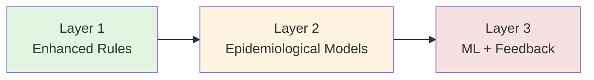
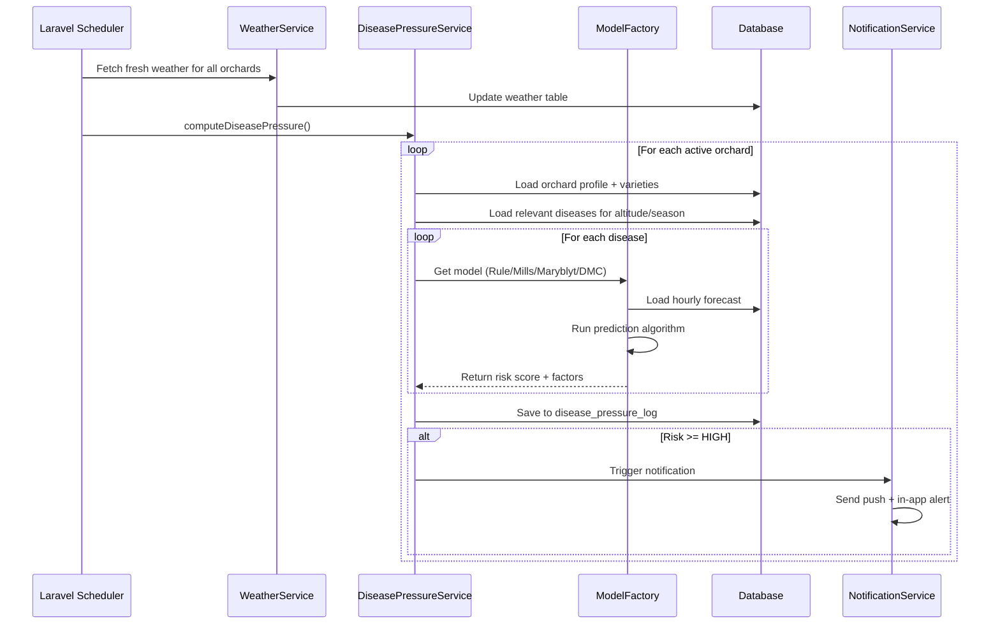
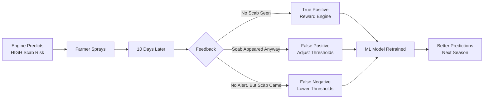
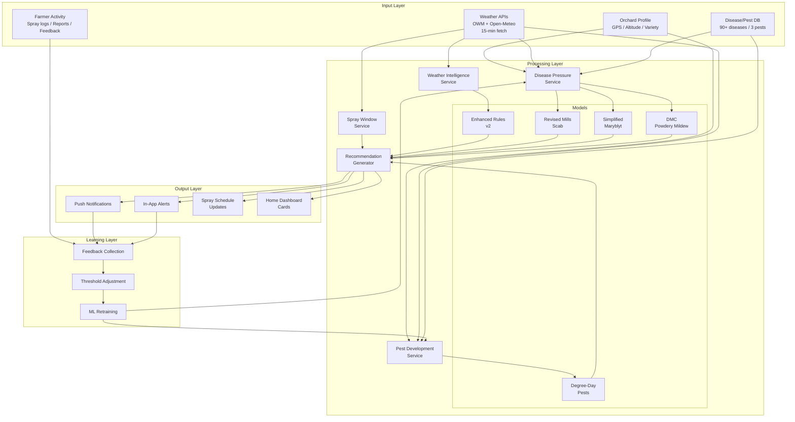
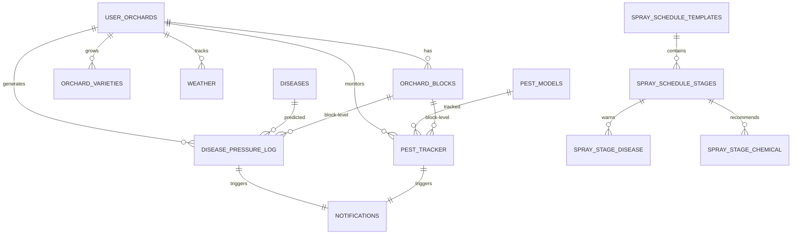

# Baagvaani Prediction + Recommendation Engine

**Idea:** [Baagvaani — AI-Powered Apple Orchard Management](../../ideas/developing/2026-05-16-baagvaani-apple-orchard-management.md)
**Date:** 2026-05-20
**Status:** Architecture Document
**Version:** 1.0

---

## Table of Contents

1. [What Is This Engine?](#what-is-this-engine)
2. [The Core Philosophy](#the-core-philosophy)
3. [Data Inputs: What Feeds the Engine](#data-inputs)
4. [The Three-Layer Brain](#the-three-layer-brain)
5. [Disease Prediction Layer](#disease-prediction-layer)
6. [Pest Prediction Layer](#pest-prediction-layer)
7. [Spray Window Layer](#spray-window-layer)
8. [Recommendation Generator](#recommendation-generator)
9. [Block-Level vs Orchard-Level Logic](#block-level-vs-orchard-level)
10. [The Feedback Loop](#the-feedback-loop)
11. [Output: What the Farmer Sees](#output-what-the-farmer-sees)
12. [Offline-First Strategy](#offline-first-strategy)
13. [Validation & Trust](#validation--trust)
14. [Architecture Diagrams](#architecture-diagrams)
15. [Implementation Phases](#implementation-phases)
16. [What Makes This Different](#what-makes-this-different)

---

## What Is This Engine?

The **Prediction + Recommendation Engine** is the brain of Baagvaani. It is not a single algorithm — it is a **system of systems** that:

1. **Watches** the weather (current + 5-day forecast) for every farmer's orchard
2. **Knows** each orchard's unique profile (altitude, varieties, tree age, slope, soil)
3. **Predicts** when diseases and pests are likely to strike **before** they strike
4. **Recommends** exactly what to do, when to do it, and what chemicals to use
5. **Learns** from farmer feedback to get smarter every season

Think of it as a **digital horticulturist** who never sleeps, checks the weather every 15 minutes, and knows the specific conditions of every block in every orchard.

> **Example:** At 6:00 AM, the engine checks Shimla farmer Ramesh's orchard. It sees rain is forecast for tomorrow afternoon, temperature will be 18°C, and humidity will hit 85%. It knows Ramesh's orchard is at 7200ft with Red Delicious (scab-susceptible). It calculates: **Apple Scab infection risk = HIGH**. It sends a push notification: *"Scab risk tomorrow. Spray Copper Oxychloride today between 6-10 AM before the rain."*

---

## The Core Philosophy

### 1. Predict, Don't Just React
Most farmers spray on a calendar schedule (every 15 days) or after seeing disease. By then, it's often too late. The engine predicts infection periods **24-72 hours in advance**, giving farmers time to act.

### 2. One Size Fits None
An orchard at 5500ft in Kullu is completely different from one at 8500ft in Kinnaur. The engine uses **altitude bands**, **microclimate data**, and **block-level profiling** to make predictions specific to each location.

### 3. Explainable, Not Black Box
Farmers need to **trust** recommendations. Every alert shows *why* the engine is warning: "Temperature 18°C + Rain forecast + Humidity 85% = Scab risk." No magic. No AI hallucinations.

### 4. Actionable, Not Academic
A risk score of "75" means nothing to a farmer. The engine translates predictions into **concrete actions**: "Spray X chemical at Y dose before Z time."

---

## Data Inputs

The engine consumes four categories of data:

### A. Orchard Profile (Static + Semi-Static)

| Data Point | Why It Matters | Stored In |
|------------|---------------|-----------|
| **GPS Location** | Hyperlocal weather fetching | `user_orchards.latitude, longitude` |
| **Altitude** | Determines season timing, disease pressure, chill hours | `user_orchards.altitude_feet` |
| **Altitude Band** | Triggers different spray schedules and models | `user_orchards.altitude_band` |
| **Varieties** | Scab susceptibility varies: Red Delicious = high, Fuji = medium | `orchard_varieties` |
| **Tree Age** | Young trees need different nutrition and spray timing | `orchard_varieties.tree_age_years` |
| **Rootstock** | Determines vigor, disease resistance, water needs | `orchard_varieties.rootstock` |
| **Farming Type** | Conventional vs Organic vs Integrated = different chemicals | `user_orchards.farming_type` |
| **Area** | Dosage calculations | `user_orchards.area_hectare` |
| **Slope & Aspect** | Sunny south slope dries faster; north slope stays wet longer | `orchard_blocks.aspect, slope_percent` |
| **Irrigation Type** | Drip vs flood affects humidity microclimate | `orchard_blocks.irrigation_type` |
| **Frost/Hail History** | Prone areas get extra weather warnings | `user_orchards.is_frost_prone, is_hail_prone` |

### B. Weather Data (Dynamic, Updated Every 15 Min)

| Data Point | Source | Use |
|------------|--------|-----|
| Current temperature | OpenWeatherMap / Open-Meteo | Disease development rate |
| Humidity | OpenWeatherMap / Open-Meteo | Infection risk (most diseases need >70%) |
| Precipitation | OpenWeatherMap / Open-Meteo | Scab spore release, fire blight spread |
| Wind speed | OpenWeatherMap / Open-Meteo | Spray safety, spore dispersal |
| Dew point | Calculated from temp + RH | Leaf wetness estimation |
| 5-day forecast | OpenWeatherMap / Open-Meteo | Prediction lookahead |
| Hourly forecast | Open-Meteo | Infection period detection, spray windows |

### C. Disease & Pest Knowledge Base (Curated by Experts)

| Data Point | Example | Use |
|------------|---------|-----|
| Optimal temp range | Scab: 6-24°C | Risk scoring |
| Humidity threshold | Scab: 90% | Risk scoring |
| Altitude range | Scab: 4000-9000ft | Geographic filtering |
| Season stages | Scab: Green Tip to Harvest | Timing predictions |
| Spore spread method | Wind, rain, insects | Model selection |
| Chemical recommendations | Copper Oxychloride 300g/200L | Action generation |

### D. Farmer Activity (Behavioral Data)

| Data Point | Use |
|------------|-----|
| Last spray date | Track spray intervals, PHI compliance |
| Sprayed chemical | Compatibility checking, resistance management |
| Disease reports submitted | Ground-truth validation for models |
| Alert feedback ("Was this correct?") | ML training data |
| Consultation history | Expert validation patterns |

---

## The Three-Layer Brain

The engine operates in three layers, from simplest to most sophisticated:



### Layer 1: Enhanced Rule Engine (Weeks 1-3)
**What it is:** An upgraded version of your existing `WeatherIntelligenceService` that uses the `Disease` model's `risk_temp_min/max`, `risk_humidity_pct`, and `altitude` fields — plus **forecast data** — to compute dynamic risk scores.

**How it works:**
1. For each disease, check if current weather matches its "happy zone"
2. Check the 5-day forecast for sustained risky conditions
3. Calculate a score 0-100 based on: temp match (40 pts) + humidity match (30 pts) + rain/wetness (20 pts) + altitude match (10 pts)
4. If score >= 60, trigger alert

**Example Output:**
> "Apple Scab risk: HIGH (75/100). Temperature 18°C is optimal. Rain forecast tomorrow. Humidity will reach 85%."

**Limitations:** Can't predict exact infection periods. Just says "risk is high."

---

### Layer 2: Epidemiological Models (Weeks 4-8)
**What it is:** Real scientific models that simulate disease biology using weather data.

**Models Implemented:**

#### Apple Scab — Revised Mills Table
- **Biology:** Scab fungus (Venturia inaequalis) needs leaf wetness + temperature to infect. At 15°C, it needs 15 hours of wetness. At 25°C, only 6 hours.
- **What the model does:** Scans hourly forecast for continuous wet periods. If wetness hours exceed the Mills threshold for the average temperature during that period → **infection predicted**.
- **Output:** "Infection period predicted: Tomorrow 2 PM - Day after 8 AM (18 hours wetness at 16°C). Severity: MODERATE."

#### Fire Blight — Simplified Maryblyt
- **Biology:** Bacteria (Erwinia amylovora) multiply on open blossom stigmas during warm, humid weather. Needs: open flowers + 110 degree-hours above 18.3°C + rain/dew + average temp > 15.6°C.
- **What the model does:** Tracks degree-hour accumulation during bloom. When all 4 conditions align → **blossom infection predicted**.
- **Output:** "Fire blight risk during bloom: HIGH. Degree-hours accumulated: 125. Rain expected tonight. Consider streptomycin spray."

#### Powdery Mildew — DMC Model
- **Biology:** Fungus (Podosphaera leucotricha) thrives in warm (20-25°C), humid conditions. Unlike scab, it does NOT need rain — high RH is enough.
- **What the model does:** Counts hours where temp is 10-25°C AND RH > 70%. More hours = higher risk.
- **Output:** "Powdery mildew risk: MEDIUM. 8 favorable hours predicted in next 48h."

#### Codling Moth — Degree-Day Model
- **Biology:** Moth development is driven by heat accumulation. Base threshold: 10°C.
- **What the model does:** Accumulates daily degree-days from biofix (first moth flight). At 250 DD → first egg hatch. At 1060 DD → first generation peak.
- **Output:** "Codling moth: 215 DD accumulated. First egg hatch expected in ~5 days (at 250 DD). Plan insecticide spray."

---

### Layer 3: ML + Farmer Feedback (Months 3-6)
**What it is:** As farmers use the app and provide feedback ("Alert was correct / wrong"), the engine learns local patterns and adjusts its thresholds.

**How it works:**
1. Farmer receives alert: "Scab risk HIGH tomorrow"
2. Farmer sprays (or doesn't)
3. 10 days later, farmer reports: "No scab seen" or "Scab appeared despite spray"
4. Engine adjusts its risk thresholds for that specific altitude band / district / season

**Example:** If the engine consistently over-predicts scab in Kinnaur during May, it learns to raise the threshold from "15 hours wetness" to "18 hours wetness" for that region.

**Technical Approach:**
- Start with simple **logistic regression** or **random forest**
- Features: altitude, variety, temp, RH, rain, wind, month, historical scab reports
- Target: binary (disease occurred / didn't occur)
- Retrain monthly during off-season

---

## Disease Prediction Layer

### The Prediction Cycle (Every Morning at 5:30 AM)



### Risk Score Interpretation

| Score | Level | Color | Meaning | Farmer Action |
|-------|-------|-------|---------|---------------|
| 0-19 | NONE | 🟢 Green | No risk | Continue normal schedule |
| 20-39 | LOW | 🟡 Yellow | Conditions slightly favorable | Monitor, no spray needed |
| 40-59 | MEDIUM | 🟠 Orange | Risk building | Prepare spray materials |
| 60-79 | HIGH | 🔴 Red | Infection likely | Spray within 24 hours |
| 80-100 | CRITICAL | 🔴🔴 Deep Red | Infection almost certain | Spray immediately |

---

## Pest Prediction Layer

### Degree-Day Accumulation (Daily at 6:30 AM)

```
For each orchard with pest tracking enabled:
  1. Get yesterday's min/max temperature from weather table
  2. For each pest model (codling moth, San Jose scale):
     a. Calculate DD = (Tmax + Tmin)/2 - Threshold
     b. Add to cumulative_dd in pest_tracker table
     c. Check if cumulative_dd crossed any event threshold
     d. If yes → generate pest alert
```

### Pest Alert Example

> **🐛 Codling Moth Alert**
> 
> **Risk:** MEDIUM → HIGH in 5 days
> **Your orchard:** 7,200 ft, Shimla district
> **Accumulated heat:** 215 degree-days
> **Next event:** First egg hatch at 250 DD (expected ~May 25)
> **Action:** Apply Chlorpyriphos 2ml/L or set up pheromone traps
> **Best spray window:** Tomorrow 6 AM - 10 AM (wind calm, no rain)

---

## Spray Window Layer

The spray window calculator answers: **"When is it safe to spray?"**

### Spray Safety Rules

| Factor | Safe Range | Why |
|--------|-----------|-----|
| Wind speed | < 15 km/h | Prevents drift, ensures coverage |
| Humidity | < 80% | Prevents droplet evaporation + phytotoxicity |
| Temperature | 10-30°C | Too cold = poor absorption; too hot = leaf burn |
| Rain | None for 4+ hours | Ensures chemical dries and sticks |

### How It Works

1. Engine scans hourly forecast for next 48 hours
2. Identifies continuous periods where ALL 4 conditions are met
3. Ranks windows: "Excellent" (6+ hours), "Good" (3-6 hours), "Short" (1-3 hours)
4. Suggests the best window BEFORE predicted infection

### Example Output

> **🚿 Spray Window Found**
>
> **Tomorrow 6:00 AM - 12:00 PM** (6 hours)
> **Rating:** ⭐⭐⭐ Excellent
> **Conditions:** Wind 8 km/h, Humidity 65%, Temp 16°C, No rain
>
> **Recommended chemical:** Copper Oxychloride 300g per 200L water
> **Target:** Apple scab prevention (rain forecast at 3 PM)
> **Tank mix:** Add Mancozeb 200g for broader protection

---

## Recommendation Generator

The recommendation generator takes the prediction output and turns it into a **personalized action plan**.

### Input → Output Mapping

```
ORCHARD PROFILE + DISEASE PREDICTION + SPRAY WINDOW + CHEMICAL DB
                              ↓
                    RECOMMENDATION GENERATOR
                              ↓
        ┌─────────────────────┼─────────────────────┐
        ↓                     ↓                     ↓
   What to spray        When to spray         How to spray
   (chemical + dose)   (date + time window)  (tank mix + safety)
```

### Example: Full Recommendation Flow

**Orchard Profile:**
- Location: Shimla, HP, 7200ft
- Variety: Red Delicious (scab-susceptible)
- Area: 2.5 acres
- Farming type: Conventional
- Last spray: Copper Oxychloride, 7 days ago

**Weather Input:**
- Current: 18°C, 75% RH, calm
- Forecast: Rain tomorrow 2 PM, temp 16-20°C, RH 85%

**Disease Prediction:**
- Apple Scab: Risk HIGH (infection period predicted: tomorrow 2 PM - day after 8 AM)

**Pest Prediction:**
- Codling Moth: 215 DD accumulated (no action yet)

**Spray Window:**
- Tomorrow 6 AM - 12 PM: EXCELLENT

**Generated Recommendation:**

> **⚠️ ACTION NEEDED: Apple Scab Prevention**
>
> **Why:** Rain + warm weather tomorrow = high scab infection risk for your Red Delicious orchard.
>
> **What to spray:**
> - Copper Oxychloride 50WP: **750g** (for 2.5 acres, 500L total water)
> - Optional: Add Mancozeb 200g for backup protection
>
> **When:** Tomorrow between **6:00 AM and 10:00 AM**
> - Wind will be calm (8 km/h)
> - No rain expected until 2 PM
> - Temperature 16°C — perfect for absorption
>
> **Safety:**
> - Wear gloves, mask, and goggles
> - Don't mix with alkaline products
> - Pre-harvest interval: 15 days (safe — harvest is in September)
>
> **After spraying:**
> - Log spray in app → earn 20 reward points
> - If rain starts before 2 PM, you are protected

---

## Block-Level vs Orchard-Level

### Orchard-Level Predictions (Default)
Uses the `user_orchards` profile. Good enough for most small farmers with one homogeneous orchard.

### Block-Level Predictions (Advanced)
Uses `orchard_blocks` for farmers with multiple varieties or microclimates.

| Block A (Upper Slope) | Block B (Valley Floor) |
|----------------------|------------------------|
| South-facing, sunny | North-facing, shady |
| Dries quickly after rain | Stays wet longer |
| **Scab risk: LOW** | **Scab risk: HIGH** |
| **Spray window: Wider** | **Spray window: Narrower** |
| Variety: Red Delicious | Variety: Granny Smith |

**Engine Logic:**
```
If orchard has blocks:
  Calculate predictions PER BLOCK
  Show block-level alerts
  Aggregate to orchard summary
Else:
  Calculate at orchard level
```

**Microclimate Adjustments:**
| Factor | Adjustment |
|--------|-----------|
| Shady / north slope | +10% wetness duration estimate |
| Sheltered valley | +5% humidity estimate |
| Exposed ridge | +20% wind speed (narrower spray windows) |
| Frost pocket | Extra frost alerts at +2°C threshold |

---

## The Feedback Loop

The engine gets smarter with every season through farmer feedback.



### Feedback UI (Mobile)

After an alert's prediction window passes, the app asks:

> **Was this alert helpful?**
> 
> [👍 Yes, scab appeared / I sprayed and it helped]
> [👎 No, nothing happened]
> [📝 Add note: __________]

### How Feedback Changes the Engine

| Feedback Pattern | System Adjustment |
|-----------------|-------------------|
| 5 farmers in Kinnaur report "false alarm" for scab in May | Raise Mills wetness threshold from 15h → 18h for Kinnaur altitude band |
| Scab outbreak in Kullu despite LOW risk alert | Lower humidity threshold from 80% → 75% for Kullu district |
| Farmer notes "sunny slope never gets scab" | Add -15% risk modifier for south-facing blocks |

---

## Output: What the Farmer Sees

### Home Dashboard (Priority Order)

```
┌─────────────────────────────────────────┐
│  🌤️ Shimla, HP  |  18°C  |  Safe spray  │
├─────────────────────────────────────────┤
│                                         │
│  ⚠️ DO NOW (2)                          │
│  ┌─────────────────────────────────┐   │
│  │ 🔴 Apple Scab — HIGH Risk       │   │
│  │ Rain tomorrow. Spray by 10 AM.  │   │
│  │ [View Details] [Mark Sprayed]   │   │
│  └─────────────────────────────────┘   │
│  ┌─────────────────────────────────┐   │
│  │ 🟡 Codling Moth — Approaching   │   │
│  │ Egg hatch in ~5 days. Prepare.  │   │
│  │ [View Details]                  │   │
│  └─────────────────────────────────┘   │
│                                         │
│  📅 NEXT 7 DAYS                         │
│  Mon 🌧️  Caution    Tue ☀️  Spray OK   │
│  Wed ☀️  Spray OK   Thu 🌧️  Caution   │
│                                         │
│  🔔 LATEST ALERTS                       │
│  • Frost risk tonight — cover trees     │
│  • Powdery mildew watch — monitor       │
│                                         │
└─────────────────────────────────────────┘
```

### Alert Detail Screen

Shows:
- **What:** Disease/pest name with photo
- **Why:** Risk factors explained visually
- **Where:** Which blocks affected
- **When:** Exact timing recommendation
- **How:** Chemical + dose + safety gear
- **Weather:** Relevant forecast snippet

---

## Offline-First Strategy

Himalayan connectivity is unreliable. The engine works offline by:

1. **Pre-computing predictions** during weather fetch (every 15 min)
2. **Caching** the next 48h of predictions in mobile MMKV storage
3. **Showing timestamp** on cached data: "Updated 2 hours ago"
4. **Queuing actions:** Farmer marks "sprayed" → queued for sync
5. **Background refresh:** When connectivity returns, fetch latest predictions

### Cached Data Structure (Mobile)

```json
{
  "cache_version": "2026-05-20T06:00:00Z",
  "orchard_id": 42,
  "predictions_48h": [...],
  "spray_windows": [...],
  "weather_summary": {...},
  "pending_actions": [
    {"type": "log_spray", "data": {...}, "synced": false}
  ]
}
```

---

## Validation & Trust

### Season 0: Shadow Mode (No Farmer-Facing Alerts)
- Engine runs predictions internally
- Compares with KVK expert recommendations
- Measures: False positive rate, false negative rate, timing accuracy
- **Goal:** <20% false positives, <5% false negatives before going live

### Season 1: Soft Launch (Opt-In Alerts)
- Farmers see predictions but labeled "BETA"
- Heavy feedback collection
- Weekly model tuning

### Season 2: Full Launch
- Predictions become primary recommendations
- Farmer feedback loop active
- Begin ML retraining

### KVK Partnership
Partner with **Dr. YS Parmar University** or **KVK Sharbo/Kotkhai**:
- They provide ground-truth disease observations
- Baagvaani provides prediction data
- Joint publication validates the system

---

## Architecture Diagrams

### End-to-End Data Flow



### Database Relationships



---

## Implementation Phases

### Phase 1: Enhanced Rules (Weeks 1-3)
- [ ] Extend `diseases` table with model flags
- [ ] Build `DiseasePressureService` (rule-based v2)
- [ ] Add forecast-driven risk scoring
- [ ] Pre-compute predictions at weather fetch time
- [ ] Mobile: Weather screen + prediction cards

### Phase 2: Scientific Models (Weeks 4-8)
- [ ] Implement Revised Mills (scab)
- [ ] Implement Simplified Maryblyt (fire blight)
- [ ] Implement DMC (powdery mildew)
- [ ] Implement Degree-Day tracker (codling moth, San Jose scale)
- [ ] Build `orchard_blocks` table + API
- [ ] Mobile: Block manager + per-block predictions

### Phase 3: Intelligence (Months 3-6)
- [ ] Microclimate adjustments (slope, aspect, exposure)
- [ ] Farmer feedback loop
- [ ] Simple ML model (random forest on feedback data)
- [ ] KVK validation partnership
- [ ] Season-end model audit and retraining

---

## What Makes This Different

| Feature | Calendar Spraying | Generic Weather App | RIMpro/NEWA | **Baagvaani Engine** |
|---------|-------------------|---------------------|-------------|---------------------|
| **Cost** | Free (but wasteful) | Free | $$$ subscription | Free / Freemium |
| **Language** | N/A | English | English | **Hindi + English** |
| **Altitude-aware** | ❌ | ❌ | ❌ | **✅ Core feature** |
| **Block-level** | ❌ | ❌ | Some | **✅ Planned** |
| **Offline** | N/A | ❌ | ❌ | **✅ Critical** |
| **Actionable** | Vague | No | Complex graphs | **✅ Simple instructions** |
| **Made for HP** | ❌ | ❌ | ❌ | **✅ Native** |
| **Learns** | ❌ | ❌ | Static models | **✅ Feedback loop** |

---

## Related Documents

- [Global DSS Landscape Research](../research/competitors/2026-05-20-apple-dss-global-landscape.md)
- [Technical Architecture with Pseudocode](../research/tech-stack/2026-05-20-baagvaani-prediction-engine-architecture.md)
- [Feature Implementation Research](../research/tech-stack/2026-05-17-baagvaani-feature-implementation-research.md)
- [MVP Plan](../plans/mvp/2026-05-16-baagvaani-mvp-plan.md)
