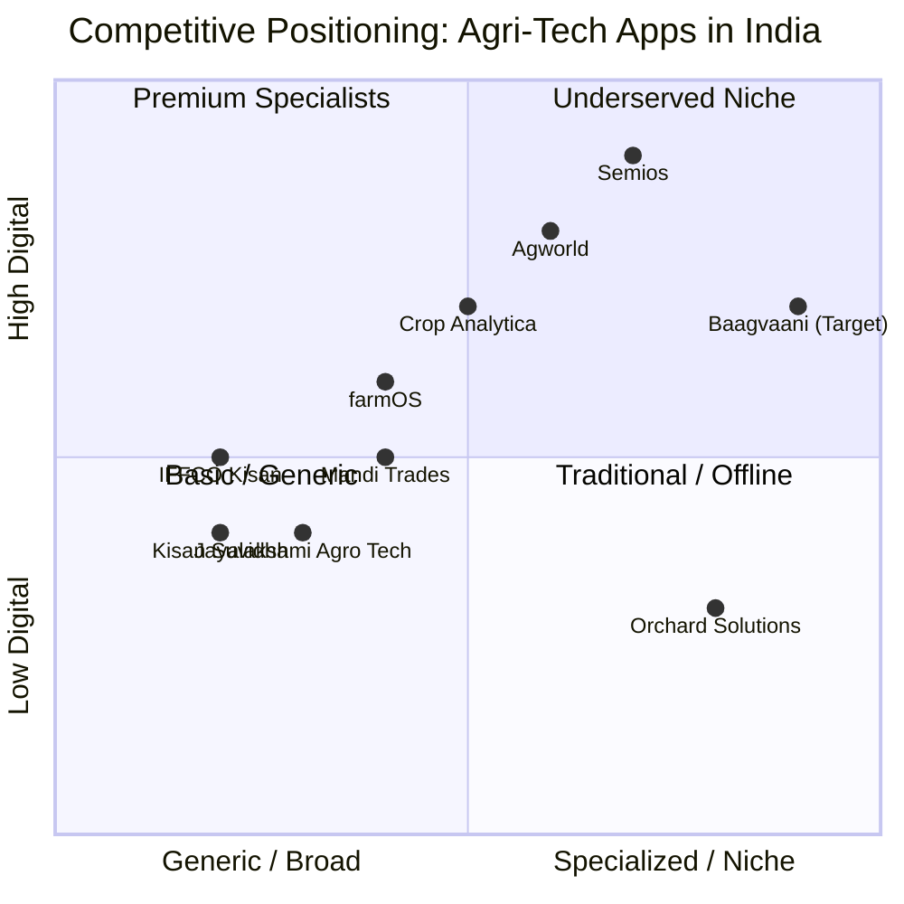

# Competitor Analysis: Baagvaani vs. Agri-Tech Landscape

**Project:** Baagvaani (बागीचा) — Apple Orchard Management App
**Date:** 2026-05-15
**Researcher:** AI Curator
**Focus:** Direct & indirect competitors in farm management, orchard tech, and agri-advisory in India

---

## Competitive Landscape Overview

---

## Direct Competitors (Orchard / Apple Focus)

### 1. Orchard Solutions (orchardsolutions.in)

| Attribute | Details |
|-----------|---------|
| **Type** | Technology + Consultancy Hybrid |
| **Regions** | Himachal, J&K, Uttarakhand (exact same as Baagvaani!) |
| **Model** | B2B consultancy + digital tools + on-ground training |
| **Services** | Plantation guidance, farm monitoring, pest control advisory, market linkage, training workshops |
| **Strengths** | Established brand, on-ground presence, expert network, government connections |
| **Weaknesses** | Not a self-service app; expensive; not scalable to small farmers; no mobile-first experience |
| **Pricing** | Consultancy fees (likely ₹5,000-50,000+ per orchard) |
| **Our Advantage** | **Free/cheap self-service app** that any farmer can use without hiring experts |

**Verdict:** ⚠️ **Real Threat** — They have the same vision but different delivery model. If they build an app, they'd be direct competition.

---

### 2. Semios (semios.com)

| Attribute | Details |
|-----------|---------|
| **Type** | IoT + AI Orchard Management Platform |
| **Regions** | Global (USA, Canada, Australia, Europe); **NOT in India** |
| **Model** | B2B enterprise — sells sensor networks + software |
| **Features** | Weather monitoring, pest pressure tracking, irrigation automation, frost alerts |
| **Strengths** | Advanced IoT + AI, proven ROI (20%+ yield improvement), strong in tree fruits |
| **Weaknesses** | **Extremely expensive** ($500-2000+/acre/year), requires hardware, no Indian presence |
| **Pricing** | Enterprise SaaS + hardware costs |
| **Our Advantage** | **No hardware required**, works on any smartphone, priced for Indian smallholders |

**Verdict:** ✅ **Not a threat** — Different market segment (enterprise vs. smallholder)

---

## Indirect Competitors (Generic Farm Apps)

### 3. IFFCO Kisan

| Attribute | Details |
|-----------|---------|
| **Type** | Government-backed agri-information app |
| **Reach** | Millions of farmers across India |
| **Features** | Weather, market prices, expert advice, news, IFFCO product info |
| **Strengths** | Massive reach, free, trusted brand, multi-language |
| **Weaknesses** | **Generic** (not crop-specific), no orchard management, no spray scheduling, no disease library |
| **Our Advantage** | **Apple-specific, altitude-aware, disease-focused, spray calendar** |

---

### 4. Kisan Suvidha (Government of India)

| Attribute | Details |
|-----------|---------|
| **Type** | Government agri-advisory app |
| **Reach** | Pan-India, government promoted |
| **Features** | Weather, market prices, dealer info, expert helpline |
| **Strengths** | Free, government credibility, wide reach |
| **Weaknesses** | Basic UI, no specialized crop content, no digital tools, poor engagement |
| **Our Advantage** | **Superior UX, specialized apple content, actionable tools** |

---

### 5. Crop Analytica

| Attribute | Details |
|-----------|---------|
| **Type** | Farm management SaaS + crop monitoring |
| **Model** | B2B — sells to agribusinesses and cooperatives |
| **Features** | Satellite monitoring, compliance tracking, field operations, analytics |
| **Strengths** | Professional platform, satellite data, export compliance |
| **Weaknesses** | **B2B focus**, not for individual farmers, expensive, no apple specialization |
| **Our Advantage** | **B2C farmer-first, apple-specific, affordable** |

---

### 6. farmOS

| Attribute | Details |
|-----------|---------|
| **Type** | Open-source farm management platform |
| **Model** | Free open-source + paid cloud hosting |
| **Features** | Record keeping, planning, mapping, inventory |
| **Strengths** | Free, customizable, community-driven |
| **Weaknesses** | **Requires technical skill**, no mobile app (PWA only), not apple-specific, steep learning curve |
| **Our Advantage** | **Native mobile app, zero setup, apple-specific content** |

---

### 7. Jayalakshmi Agro Tech

| Attribute | Details |
|-----------|---------|
| **Type** | Regional crop advisory app (Karnataka focused) |
| **Model** | Free app with crop-specific info |
| **Features** | Info on 15 crops: coconut, sugarcane, banana, tomato, paddy |
| **Strengths** | Regional focus, vernacular content |
| **Weaknesses** | **No apple**, limited to Karnataka, basic functionality |
| **Our Advantage** | **Himalayan apple focus, comprehensive disease/spray tools** |

---

### 8. Agworld

| Attribute | Details |
|-----------|---------|
| **Type** | Global farm management platform |
| **Model** | B2B SaaS subscription |
| **Pricing** | $50+/month per user |
| **Strengths** | Professional, comprehensive, integrates with advisors |
| **Weaknesses** | **Not available in India**, expensive, complex, English-only |
| **Our Advantage** | **India-first, Hindi+English, affordable** |

---

## Feature Comparison Matrix

| Feature | Baagvaani (Planned) | Orchard Solutions | IFFCO Kisan | Semios | farmOS | Crop Analytica |
|---------|-------------------|-------------------|-------------|--------|--------|----------------|
| Apple-specific content | ✅ | ✅ | ❌ | ✅ | ❌ | ❌ |
| Altitude-aware schedules | ✅ | ⚠️ | ❌ | ✅ | ❌ | ❌ |
| Spray calendar | ✅ | ✅ | ❌ | ✅ | ⚠️ | ❌ |
| Disease library with photos | ✅ | ✅ | ❌ | ✅ | ❌ | ❌ |
| Weather alerts | ✅ | ✅ | ✅ | ✅ | ⚠️ | ✅ |
| Mandi price tracking | ✅ | ✅ | ✅ | ❌ | ❌ | ⚠️ |
| Hindi language | ✅ | ⚠️ | ✅ | ❌ | ❌ | ❌ |
| Offline mode | ✅ | ❌ | ❌ | ⚠️ | ⚠️ | ❌ |
| Free for farmers | ✅ | ❌ | ✅ | ❌ | ✅ | ❌ |
| No hardware required | ✅ | ⚠️ | ✅ | ❌ | ✅ | ✅ |
| Orchard record keeping | ✅ | ✅ | ❌ | ✅ | ✅ | ✅ |
| Rootstock & variety DB | ✅ | ✅ | ❌ | ⚠️ | ❌ | ❌ |
| Expert consultation | ⚠️ | ✅ | ✅ | ✅ | ❌ | ✅ |

Legend: ✅ = Yes, ❌ = No, ⚠️ = Partial/Limited

---

## SWOT Analysis

### Strengths (Baagvaani's Advantages)
1. **First-mover** in apple-specific, Himalayan-focused orchard app
2. **Altitude-aware intelligence** — unique differentiator
3. **Bilingual** (Hindi + English) — critical for farmer adoption
4. **Free for farmers** — removes adoption barrier
5. **No hardware** — works on any smartphone
6. **Offline capability** — essential for spotty mountain connectivity
7. **React Native + Laravel** — modern, scalable stack

### Weaknesses (Our Gaps)
1. **No brand recognition** — starting from zero
2. **No on-ground team** — trust-building takes time in villages
3. **Single developer** — limited bandwidth
4. **No verified data partnerships** — weather APIs, mandi prices need integration
5. **No agriculture experts on team** — content validation risk

### Opportunities (Market Gaps)
1. **Climate adaptation urgency** — demand growing every year
2. **Youth taking over orchards** — digital-native generation
3. **Government subsidies for agri-tech** — funding opportunities
4. **No apple-specific app exists** — blue ocean
5. **Mandi price transparency** — huge value add
6. **Input marketplace** — seeds, pesticides, equipment
7. **Cold storage directory** — connect farmers to storage

### Threats (What Could Kill Us)
1. **Orchard Solutions builds an app** — they have brand + expertise
2. **Government launches apple-specific app** — free + trusted
3. **IFFCO adds apple module** — massive distribution
4. **Farmer apathy** — older farmers may resist digital tools
5. **Connectivity issues** — Himalayan network is unreliable
6. **Data accuracy** — wrong spray advice = crop damage = trust destroyed

---

## Strategic Recommendations

### Defensive Moats
1. **Speed to market** — Launch MVP before competitors react
2. **Community** — Build farmer WhatsApp groups / forums around the app
3. **Local partnerships** — Tie up with KVKs (Krishi Vigyan Kendras), horticulture departments
4. **Data network effects** — More users = better disease outbreak predictions
5. **Content depth** — Build the most comprehensive apple disease library in Hindi

### Attack Strategy
1. **Start free, stay free for core** — Farmer trust > short-term revenue
2. **Partner with Orchard Solutions** — They do high-end consultancy; we do mass-market digital. Complementary.
3. **Leverage KVKs** — Government training centers can promote the app
4. **Farmer testimonials** — Video testimonials from early users = best marketing
5. **Apple Mandi presence** — Put QR codes at Shimla, Kullu, Srinagar apple markets

---

## Key Takeaways

1. **No direct app competitor** exists for Himalayan apple farmers
2. **Orchard Solutions** is the closest concept competitor but not an app — potential partner
3. **Generic apps** (IFFCO Kisan, Kisan Suvidha) lack specialization — we win on depth
4. **Enterprise tools** (Semios, Agworld, Crop Analytica) are too expensive for smallholders
5. **Window is open NOW** — first to build a great product owns the category

---

## Sources

1. [Orchard Solutions Website](https://orchardsolutions.in/) — 2026
2. [India AgroNet — Agriculture Apps](https://indiaagronet.com/Agriculture-Information/Agriculture-Information-Apps.html)
3. [Semios — Orchard Management](https://www.semios.com/)
4. [farmOS — Open Source Farm Management](https://farmos.org/)
5. [Crop Analytica](https://www.cropanalytica.com/)
6. [SourceForge — Farm Management Software India](https://sourceforge.net/software/farm-management/india/)
7. [CropLife — Best Agriculture Apps 2025](https://www.croplife.com/editorial/best-agriculture-apps/)
