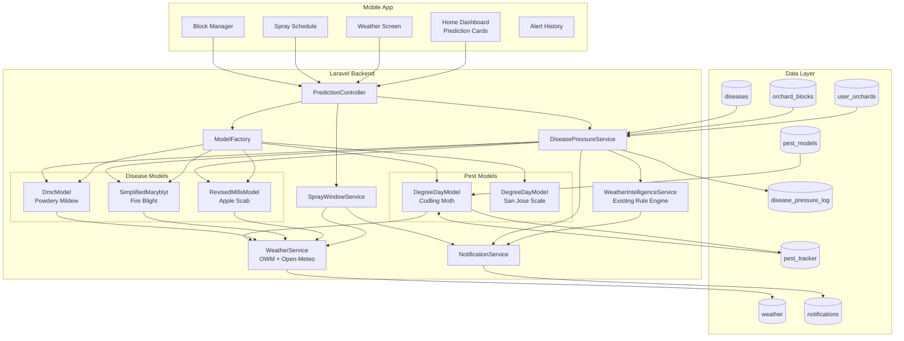

# Technical Architecture: Intelligent Prediction + Alert Engine for Baagvaani

**Idea:** [Baagvaani — AI-Powered Apple Orchard Management](../../ideas/developing/2026-05-16-baagvaani-apple-orchard-management.md)
**Date:** 2026-05-20
**Researcher:** AI Curator
**Focus:** How to build a forecast-driven disease/pest prediction engine on top of Baagvaani's existing Laravel + React Native stack

---

## Executive Summary

Baagvaani already has **80% of the infrastructure** needed for an intelligent prediction engine:
- ✅ Weather fetching (OpenWeatherMap + Open-Meteo, every 15 min)
- ✅ Rule-based alert engine (`WeatherIntelligenceService`) with JSON condition trees
- ✅ Disease model with environmental risk fields (`risk_temp_min/max`, `risk_humidity_pct`)
- ✅ Scheduled commands (`update-weather-data`, `process-weather-alerts`)
- ✅ Notification pipeline (push, in-app, deduplication)
- ✅ Orchard profile with altitude, location, varieties

**This document specifies how to extend the existing system** into a true prediction engine using:
1. **Phase 1:** Enhanced rule engine (forecast-driven risk scores) — 2-3 weeks
2. **Phase 2:** Epidemiological models (Revised Mills, Simplified Maryblyt, DMC, Degree-Days) — 4-6 weeks
3. **Phase 3:** Block-level microclimate + farmer feedback ML — 3+ months

---

## 1. Data Model Extensions

### 1.1 New Table: `orchard_blocks` (Block-Level Management)

```sql
CREATE TABLE orchard_blocks (
  id BIGINT UNSIGNED AUTO_INCREMENT PRIMARY KEY,
  user_orchard_id BIGINT UNSIGNED NOT NULL,
  user_id BIGINT UNSIGNED NOT NULL,
  name VARCHAR(100) NOT NULL,              -- e.g., "Block A", "Upper Slope"
  variety_id BIGINT UNSIGNED NULL,
  rootstock_id BIGINT UNSIGNED NULL,
  area_kanal DECIMAL(8,2) NULL,
  plant_count INT UNSIGNED NULL,
  tree_age_years TINYINT UNSIGNED NULL,
  spacing_meters VARCHAR(20) NULL,         -- e.g., "4x4"
  soil_type ENUM('loam','clay','sandy','silty','peaty') NULL,
  soil_ph DECIMAL(3,1) NULL,
  irrigation_type ENUM('drip','sprinkler','flood','rainfed') NULL,
  aspect ENUM('north','south','east','west','flat') NULL,  -- slope direction
  slope_percent TINYINT UNSIGNED NULL,     -- e.g., 15 = 15% slope
  is_sunny_exposure BOOLEAN DEFAULT TRUE,  -- vs shaded
  wind_exposure ENUM('sheltered','moderate','exposed') NULL,
  frost_pocket_risk ENUM('low','medium','high') NULL,
  created_at TIMESTAMP DEFAULT CURRENT_TIMESTAMP,
  updated_at TIMESTAMP DEFAULT CURRENT_TIMESTAMP ON UPDATE CURRENT_TIMESTAMP,
  
  INDEX idx_orchard (user_orchard_id),
  INDEX idx_user (user_id),
  FOREIGN KEY (user_orchard_id) REFERENCES user_orchards(id) ON DELETE CASCADE,
  FOREIGN KEY (user_id) REFERENCES users(id) ON DELETE CASCADE,
  FOREIGN KEY (variety_id) REFERENCES varieties(id) ON DELETE SET NULL,
  FOREIGN KEY (rootstock_id) REFERENCES rootstocks(id) ON DELETE SET NULL
);
```

### 1.2 New Table: `pest_models` (Pest Configuration)

```sql
CREATE TABLE pest_models (
  id SMALLINT UNSIGNED AUTO_INCREMENT PRIMARY KEY,
  name_en VARCHAR(100) NOT NULL,
  name_hi VARCHAR(100) NULL,
  scientific_name VARCHAR(100) NULL,
  type ENUM('insect','mite','mollusk','nematode') NOT NULL,
  threshold_temp_c DECIMAL(4,1) NOT NULL,    -- Lower development threshold
  cutoff_temp_c DECIMAL(4,1) NULL,           -- Upper cutoff (optional)
  dd_target_first_event INT UNSIGNED NULL,   -- DD to first key event
  dd_target_second_event INT UNSIGNED NULL,
  dd_target_third_event INT UNSIGNED NULL,
  event_labels JSON NULL,                    -- ["First egg hatch", "Peak flight"]
  applicable_months JSON NULL,               -- [4,5,6,7,8]
  applicable_altitude_bands JSON NULL,       -- ["below_6000","6000_8000"]
  is_active BOOLEAN DEFAULT TRUE,
  sort_order SMALLINT UNSIGNED DEFAULT 0,
  
  INDEX idx_active (is_active, sort_order)
);

-- Seed data for Phase 2
INSERT INTO pest_models (name_en, name_hi, scientific_name, type, threshold_temp_c, cutoff_temp_c, dd_target_first_event, dd_target_second_event, dd_target_third_event, event_labels, applicable_months, applicable_altitude_bands) VALUES
('Codling Moth', 'सेब का कीड़ा', 'Cydia pomonella', 'insect', 10.0, 31.1, 250, 1060, 2120, '["3% Egg Hatch","1st Gen Peak","2nd Gen Peak"]', '[5,6,7,8,9]', '["below_6000","6000_8000","above_8000"]'),
('San Jose Scale', 'सैन जोसे स्केल', 'Quadraspidiotus perniciosus', 'insect', 10.5, NULL, 405, 800, 1200, '["Crawler Emergence","1st Gen Crawlers","2nd Gen Crawlers"]', '[4,5,6,7,8]', '["below_6000","6000_8000","above_8000"]'),
('Woolly Apple Aphid', 'ऊनी सेब माहू', 'Eriosoma lanigerum', 'insect', 7.0, NULL, NULL, NULL, NULL, '["Colony Detection"]', '[4,5,6,7,8,9,10]', '["below_6000","6000_8000"]');
```

### 1.3 New Table: `pest_tracker` (Per-Orchard DD Accumulation)

```sql
CREATE TABLE pest_tracker (
  id BIGINT UNSIGNED AUTO_INCREMENT PRIMARY KEY,
  user_orchard_id BIGINT UNSIGNED NOT NULL,
  orchard_block_id BIGINT UNSIGNED NULL,
  pest_model_id SMALLINT UNSIGNED NOT NULL,
  season_year SMALLINT UNSIGNED NOT NULL,
  biofix_date DATE NULL,                   -- User-set or regional default
  biofix_source ENUM('trap','default','expert','user_reported') DEFAULT 'default',
  cumulative_dd DECIMAL(8,1) DEFAULT 0,    -- Current season accumulation
  last_event_triggered VARCHAR(50) NULL,   -- Last DD event that fired
  next_event_at_dd INT UNSIGNED NULL,      -- Next predicted event
  risk_level ENUM('none','low','medium','high','critical') DEFAULT 'none',
  updated_at TIMESTAMP DEFAULT CURRENT_TIMESTAMP ON UPDATE CURRENT_TIMESTAMP,
  
  UNIQUE KEY uk_tracker (user_orchard_id, orchard_block_id, pest_model_id, season_year),
  INDEX idx_next_event (next_event_at_dd, risk_level),
  FOREIGN KEY (user_orchard_id) REFERENCES user_orchards(id) ON DELETE CASCADE,
  FOREIGN KEY (orchard_block_id) REFERENCES orchard_blocks(id) ON DELETE CASCADE,
  FOREIGN KEY (pest_model_id) REFERENCES pest_models(id) ON DELETE CASCADE
);
```

### 1.4 New Table: `disease_pressure_log` (Dynamic Risk Scoring)

```sql
CREATE TABLE disease_pressure_log (
  id BIGINT UNSIGNED AUTO_INCREMENT PRIMARY KEY,
  user_orchard_id BIGINT UNSIGNED NOT NULL,
  orchard_block_id BIGINT UNSIGNED NULL,
  disease_id BIGINT UNSIGNED NOT NULL,
  prediction_date DATE NOT NULL,           -- Date this prediction is for
  prediction_type ENUM('rule','mills','maryblyt','dmc','dd_model','ml') DEFAULT 'rule',
  risk_score TINYINT UNSIGNED NOT NULL,    -- 0-100
  risk_level ENUM('none','low','medium','high','critical') NOT NULL,
  trigger_factors JSON NULL,               -- Which conditions triggered risk
  weather_snapshot JSON NULL,              -- Temp, RH, rain, wind at time of calc
  spray_recommendation TEXT NULL,          -- Suggested action
  is_confirmed BOOLEAN NULL,               -- Farmer feedback: was alert correct?
  farmer_feedback TEXT NULL,
  created_at TIMESTAMP DEFAULT CURRENT_TIMESTAMP,
  
  INDEX idx_orchard_disease (user_orchard_id, disease_id, prediction_date),
  INDEX idx_risk (risk_level, prediction_date),
  FOREIGN KEY (user_orchard_id) REFERENCES user_orchards(id) ON DELETE CASCADE,
  FOREIGN KEY (orchard_block_id) REFERENCES orchard_blocks(id) ON DELETE CASCADE,
  FOREIGN KEY (disease_id) REFERENCES diseases(id) ON DELETE CASCADE
);
```

### 1.5 Extend `diseases` Table (Add Model-Specific Fields)

```sql
ALTER TABLE diseases ADD COLUMN mills_temp_min_c TINYINT NULL AFTER risk_temp_max_c;
ALTER TABLE diseases ADD COLUMN mills_temp_max_c TINYINT NULL AFTER mills_temp_min_c;
ALTER TABLE diseases ADD COLUMN mills_wetness_hours JSON NULL AFTER mills_temp_max_c;
-- Example: {"6": 18, "10": 12, "15": 9, "20": 8, "25": 6} = hours needed at each temp

ALTER TABLE diseases ADD COLUMN is_mills_applicable BOOLEAN DEFAULT FALSE;
ALTER TABLE diseases ADD COLUMN is_maryblyt_applicable BOOLEAN DEFAULT FALSE;
ALTER TABLE diseases ADD COLUMN is_dmc_applicable BOOLEAN DEFAULT FALSE;
ALTER TABLE diseases ADD COLUMN maryblyt_dh_threshold INT UNSIGNED NULL;
ALTER TABLE diseases ADD COLUMN maryblyt_temp_threshold_c DECIMAL(4,1) NULL;
```

### 1.6 Extend `weather` Table (Add Hourly Forecast Cache)

```sql
ALTER TABLE weather ADD COLUMN hourly_forecast_48h JSON NULL AFTER forecast_5day;
ALTER TABLE weather ADD COLUMN leaf_wetness_estimated_hours TINYINT UNSIGNED NULL AFTER strong_wind_alert;
ALTER TABLE weather ADD COLUMN dew_point_c DECIMAL(4,1) NULL AFTER leaf_wetness_estimated_hours;
```

---

## 2. Backend Architecture

### 2.1 New Services

```
app/Services/
├── Prediction/
│   ├── DiseasePressureService.php          -- Orchestrates all disease models
│   ├── PestDevelopmentService.php          -- Degree-day accumulator
│   ├── SprayWindowService.php              -- Optimal spray timing calculator
│   ├── LeafWetnessEstimator.php            -- Estimates wetness from forecast
│   ├── MicroclimateService.php             -- Block-level adjustments
│   └── ModelFactory.php                    -- Returns correct model instance
├── Models/
│   ├── Scab/
│   │   ├── MillsTableModel.php
│   │   └── RevisedMillsModel.php
│   ├── FireBlight/
│   │   └── SimplifiedMaryblytModel.php
│   ├── PowderyMildew/
│   │   └── DmcModel.php
│   └── Pests/
│       └── DegreeDayModel.php
```

### 2.2 Command Schedule Updates

```php
// app/Console/Kernel.php
$schedule->command('app:update-weather-data')->everyFifteenMinutes();
$schedule->command('app:process-weather-alerts')->dailyAt('06:00');
$schedule->command('app:send-spray-reminders')->dailyAt('08:00');

// NEW COMMANDS:
$schedule->command('app:compute-disease-pressure')->dailyAt('05:30');  // Before alerts
$schedule->command('app:accumulate-pest-dd')->dailyAt('06:30');        // Daily DD update
$schedule->command('app:compute-spray-windows')->twiceDaily(7, 19);    -- Morning & evening
```

---

## 3. Algorithm Specifications

### 3.1 Phase 1: Enhanced Rule Engine v2 (Immediate)

**Goal:** Use existing `Disease.risk_*` fields + 5-day forecast to compute dynamic risk scores.

```php
// DiseasePressureService::computeRuleBasedRisk()
function computeRuleBasedRisk(Disease $disease, Weather $weather, UserOrchard $orchard): array
{
    $score = 0;
    $factors = [];
    
    // Temperature match (0-40 points)
    if ($weather->temperature >= $disease->risk_temp_min_c && 
        $weather->temperature <= $disease->risk_temp_max_c) {
        $score += 30;
        $factors[] = 'optimal_temperature';
    } elseif (abs($weather->temperature - $disease->risk_temp_min_c) <= 3 ||
              abs($weather->temperature - $disease->risk_temp_max_c) <= 3) {
        $score += 15;
        $factors[] = 'near_optimal_temperature';
    }
    
    // Humidity match (0-30 points)
    if ($weather->humidity >= $disease->risk_humidity_pct) {
        $score += 30;
        $factors[] = 'high_humidity';
    } elseif ($weather->humidity >= $disease->risk_humidity_pct - 10) {
        $score += 15;
        $factors[] = 'elevated_humidity';
    }
    
    // Rain / wetness (0-20 points)
    if ($weather->precipitation > 2.5) {
        $score += 20;
        $factors[] = 'rain_present';
    } elseif ($weather->precipitation > 0) {
        $score += 10;
        $factors[] = 'light_rain';
    }
    
    // Altitude match (0-10 points)
    $orchardAltFt = $orchard->altitude_feet;
    if ($orchardAltFt >= $disease->altitude_min_feet && 
        $orchardAltFt <= $disease->altitude_max_feet) {
        $score += 10;
        $factors[] = 'altitude_match';
    }
    
    // Forecast lookahead (boost score if conditions persist)
    $forecast = $weather->forecast_5day ?? [];
    $riskDaysAhead = 0;
    foreach ($forecast as $day) {
        if (($day['temp_max'] ?? 0) >= $disease->risk_temp_min_c &&
            ($day['temp_max'] ?? 0) <= $disease->risk_temp_max_c &&
            ($day['humidity'] ?? 0) >= $disease->risk_humidity_pct - 10 &&
            ($day['rain'] ?? 0) > 0) {
            $riskDaysAhead++;
        }
    }
    if ($riskDaysAhead >= 2) {
        $score += 10; // Bonus for sustained risk
        $factors[] = "forecast_risk_{$riskDaysAhead}d";
    }
    
    // Map to levels
    $level = match(true) {
        $score >= 80 => 'critical',
        $score >= 60 => 'high',
        $score >= 40 => 'medium',
        $score >= 20 => 'low',
        default => 'none'
    };
    
    return [
        'score' => min($score, 100),
        'level' => $level,
        'factors' => $factors,
        'forecast_risk_days' => $riskDaysAhead
    ];
}
```

### 3.2 Phase 2a: Revised Mills Table for Apple Scab

**Goal:** Predict infection periods using temperature + estimated leaf wetness hours.

```php
// Scab/RevisedMillsModel.php
class RevisedMillsModel
{
    // Revised Mills minimum wetness hours for infection (temp C => hours)
    const MILLS_TABLE = [
        0 => 40,   3 => 30,   6 => 25,   9 => 21,
        12 => 18,  15 => 15,  18 => 13,  21 => 12,
        24 => 11,  27 => 10,  30 => 9
    ];
    
    // For secondary infections (conidia), multiply by 2/3
    const SECONDARY_MULTIPLIER = 0.67;
    
    public function calculate(array $hourlyData, bool $isSecondary = false): array
    {
        $infectionPeriods = [];
        $wetnessStart = null;
        $wetnessHours = 0;
        $tempSum = 0;
        
        foreach ($hourlyData as $hour) {
            $isWet = $this->isLeafWet($hour); // From RH > 85% or rain > 0.1mm or dew
            
            if ($isWet) {
                if ($wetnessStart === null) {
                    $wetnessStart = $hour['timestamp'];
                }
                $wetnessHours++;
                $tempSum += $hour['temperature'];
            } else {
                // Wet period ended — evaluate
                if ($wetnessHours >= 4) { // Minimum meaningful period
                    $avgTemp = $tempSum / $wetnessHours;
                    $requiredHours = $this->interpolateMills($avgTemp);
                    
                    if ($isSecondary) {
                        $requiredHours *= self::SECONDARY_MULTIPLIER;
                    }
                    
                    $severity = match(true) {
                        $wetnessHours >= $requiredHours * 1.5 => 'severe',
                        $wetnessHours >= $requiredHours => 'moderate',
                        $wetnessHours >= $requiredHours * 0.75 => 'light',
                        default => null
                    };
                    
                    if ($severity) {
                        $infectionPeriods[] = [
                            'start' => $wetnessStart,
                            'end' => $hour['timestamp'],
                            'hours' => $wetnessHours,
                            'avg_temp' => round($avgTemp, 1),
                            'required_hours' => round($requiredHours, 1),
                            'severity' => $severity,
                            'infection_occurred' => $wetnessHours >= $requiredHours
                        ];
                    }
                }
                
                $wetnessStart = null;
                $wetnessHours = 0;
                $tempSum = 0;
            }
        }
        
        return $infectionPeriods;
    }
    
    private function isLeafWet(array $hour): bool
    {
        // Estimate leaf wetness from available data
        $rh = $hour['humidity'] ?? 0;
        $rain = $hour['precipitation'] ?? 0;
        $dewPoint = $hour['dew_point'] ?? ($hour['temperature'] - ((100 - $rh) / 5));
        $isDew = ($hour['temperature'] - $dewPoint) < 2.5; // Within 2.5°C of dew point
        
        return $rh >= 85 || $rain >= 0.1 || $isDew;
    }
    
    private function interpolateMills(float $avgTemp): float
    {
        $temps = array_keys(self::MILLS_TABLE);
        sort($temps);
        
        foreach ($temps as $i => $t) {
            if ($avgTemp <= $t) {
                $lowerT = $temps[$i - 1] ?? $t;
                $lowerH = self::MILLS_TABLE[$lowerT];
                $upperH = self::MILLS_TABLE[$t];
                $ratio = ($avgTemp - $lowerT) / ($t - $lowerT);
                return $lowerH + ($upperH - $lowerH) * $ratio;
            }
        }
        return self::MILLS_TABLE[end($temps)];
    }
}
```

### 3.3 Phase 2b: Simplified Maryblyt for Fire Blight

**Goal:** During bloom, predict blossom infection risk.

```php
// FireBlight/SimplifiedMaryblytModel.php
class SimplifiedMaryblytModel
{
    // For apples: 110 DH > 18.3°C within last 80 DD > 4.4°C
    const DH_THRESHOLD = 110;
    const DH_TEMP_THRESHOLD = 18.3;
    const DD_BASE_TEMP = 4.4;
    const DD_WINDOW = 80;
    const RAIN_THRESHOLD_MM = 0.25;
    const AVG_TEMP_THRESHOLD = 15.6;
    
    public function calculate(
        array $hourlyData, 
        bool $blossomsOpen, 
        ?float $cumulativeDh = null,
        ?float $cumulativeDd = null
    ): array {
        if (!$blossomsOpen) {
            return ['risk' => 'none', 'reason' => 'no_blossoms'];
        }
        
        // Accumulate DH and DD from hourly data
        $dh = $cumulativeDh ?? 0;
        $dd = $cumulativeDd ?? 0;
        $hasRain = false;
        $avgTemp = 0;
        $hourCount = 0;
        
        foreach ($hourlyData as $hour) {
            $temp = $hour['temperature'];
            
            // Degree-Hours
            if ($temp > self::DH_TEMP_THRESHOLD) {
                $dh += ($temp - self::DH_TEMP_THRESHOLD);
            }
            
            // Degree-Days (simplified: use daily max/min in real impl)
            if ($temp > self::DD_BASE_TEMP) {
                $dd += ($temp - self::DD_BASE_TEMP) / 24; // Per hour contribution
            }
            
            if (($hour['precipitation'] ?? 0) >= self::RAIN_THRESHOLD_MM) {
                $hasRain = true;
            }
            
            $avgTemp += $temp;
            $hourCount++;
        }
        
        $avgTemp = $avgTemp / max($hourCount, 1);
        
        // BHWT conditions
        $b = true; // Blossoms open
        $h = $dh >= self::DH_THRESHOLD; // EIP threshold
        $w = $hasRain; // Wetness
        $t = $avgTemp >= self::AVG_TEMP_THRESHOLD; // Warm enough
        
        $conditionsMet = (int)$h + (int)$w + (int)$t;
        
        $risk = match($conditionsMet) {
            3 => 'infection',
            2 => 'high',
            1 => 'moderate',
            0 => 'low',
        };
        
        return [
            'risk' => $risk,
            'blossoms_open' => $b,
            'eip_met' => $h,
            'wetness_met' => $w,
            'temp_met' => $t,
            'cumulative_dh' => round($dh, 1),
            'cumulative_dd' => round($dd, 1),
            'avg_temp' => round($avgTemp, 1)
        ];
    }
}
```

### 3.4 Phase 2c: DMC-Style Powdery Mildew Model

**Goal:** Simple temp + RH threshold model for powdery mildew infection days.

```php
// PowderyMildew/DmcModel.php
class DmcModel
{
    // Powdery mildew: optimal 20-25°C + RH > 70%
    // Infection likely when: temp 10-25°C AND RH > 70% for >6 hours
    public function calculate(array $hourlyData): array
    {
        $infectionHours = 0;
        $favorableHours = 0;
        $riskScore = 0;
        
        foreach ($hourlyData as $hour) {
            $temp = $hour['temperature'];
            $rh = $hour['humidity'];
            
            $isFavorable = ($temp >= 10 && $temp <= 25 && $rh >= 70);
            $isOptimal = ($temp >= 20 && $temp <= 25 && $rh >= 80);
            
            if ($isOptimal) {
                $infectionHours++;
                $favorableHours++;
                $riskScore += 2;
            } elseif ($isFavorable) {
                $favorableHours++;
                $riskScore += 1;
            }
        }
        
        $risk = match(true) {
            $infectionHours >= 12 => 'high',
            $infectionHours >= 6 => 'medium',
            $favorableHours >= 12 => 'low',
            default => 'none'
        };
        
        return [
            'risk' => $risk,
            'infection_hours' => $infectionHours,
            'favorable_hours' => $favorableHours,
            'score' => min($riskScore, 100)
        ];
    }
}
```

### 3.5 Phase 2d: Degree-Day Model for Codling Moth

```php
// Pests/DegreeDayModel.php
class DegreeDayModel
{
    // Simple average method: DD = (Tmax + Tmin)/2 - Tthreshold
    // Capped at cutoff if applicable
    public function accumulate(
        float $tMax, 
        float $tMin, 
        float $threshold, 
        ?float $cutoff = null
    ): float {
        $avg = ($tMax + $tMin) / 2;
        
        if ($cutoff && $avg > $cutoff) {
            $avg = $cutoff;
        }
        
        $dd = $avg - $threshold;
        return max($dd, 0);
    }
    
    public function getCodlingMothEvents(float $cumulativeDd): array
    {
        $events = [];
        
        if ($cumulativeDd >= 250) {
            $events[] = ['name' => 'first_egg_hatch', 'dd' => 250, 'action' => 'Apply insecticide'];
        }
        if ($cumulativeDd >= 1060) {
            $events[] = ['name' => 'first_gen_peak', 'dd' => 1060, 'action' => 'Monitor traps, spray if needed'];
        }
        if ($cumulativeDd >= 2120) {
            $events[] = ['name' => 'second_gen_peak', 'dd' => 2120, 'action' => 'Second generation spray window'];
        }
        
        return $events;
    }
}
```

### 3.6 Spray Window Calculator

```php
// SprayWindowService.php
class SprayWindowService
{
    const MAX_WIND_KMH = 15;
    const MAX_HUMIDITY_PCT = 80;
    const MIN_HOURS_AFTER_RAIN = 4;
    const MAX_TEMP_C = 30;
    const MIN_TEMP_C = 10;
    
    public function evaluateWindow(array $hourlyForecast): array
    {
        $windows = [];
        $currentWindow = null;
        
        foreach ($hourlyForecast as $hour) {
            $safe = $this->isSpraySafe($hour);
            
            if ($safe && $currentWindow === null) {
                $currentWindow = [
                    'start' => $hour['timestamp'],
                    'hours' => 1,
                    'avg_temp' => $hour['temperature'],
                    'max_wind' => $hour['wind_speed']
                ];
            } elseif ($safe && $currentWindow !== null) {
                $currentWindow['hours']++;
                $currentWindow['avg_temp'] = ($currentWindow['avg_temp'] + $hour['temperature']) / 2;
                $currentWindow['max_wind'] = max($currentWindow['max_wind'], $hour['wind_speed']);
            } elseif (!$safe && $currentWindow !== null) {
                $windows[] = $this->classifyWindow($currentWindow);
                $currentWindow = null;
            }
        }
        
        if ($currentWindow) {
            $windows[] = $this->classifyWindow($currentWindow);
        }
        
        return $windows;
    }
    
    private function isSpraySafe(array $hour): bool
    {
        $windKmh = ($hour['wind_speed'] ?? 0) * 3.6; // m/s to km/h
        $rh = $hour['humidity'] ?? 0;
        $rain = $hour['precipitation'] ?? 0;
        $temp = $hour['temperature'] ?? 0;
        
        return $windKmh < self::MAX_WIND_KMH
            && $rh < self::MAX_HUMIDITY_PCT
            && $rain == 0
            && $temp >= self::MIN_TEMP_C
            && $temp <= self::MAX_TEMP_C;
    }
    
    private function classifyWindow(array $window): array
    {
        $window['rating'] = match(true) {
            $window['hours'] >= 6 => 'excellent',
            $window['hours'] >= 3 => 'good',
            $window['hours'] >= 1 => 'short',
            default => 'insufficient'
        };
        return $window;
    }
}
```

---

## 4. Mobile Integration

### 4.1 New API Endpoints

```php
// routes/api.php

// Prediction & Alerts
Route::get('/orchard/{orchard}/predictions', [PredictionController::class, 'index']);
Route::get('/orchard/{orchard}/predictions/disease/{disease}', [PredictionController::class, 'showDisease']);
Route::get('/orchard/{orchard}/predictions/pest/{pest}', [PredictionController::class, 'showPest']);
Route::get('/orchard/{orchard}/spray-window', [PredictionController::class, 'sprayWindow']);
Route::get('/orchard/{orchard}/forecast/detailed', [PredictionController::class, 'detailedForecast']);

// Farmer Feedback
Route::post('/predictions/{prediction}/feedback', [PredictionController::class, 'feedback']);

// Block Management
Route::apiResource('orchard.blocks', OrchardBlockController::class);
```

### 4.2 Response Format (Matches Existing Mobile Types)

```json
{
  "orchard_id": 42,
  "generated_at": "2026-05-20T06:00:00Z",
  "predictions": [
    {
      "type": "disease",
      "name": "Apple Scab",
      "name_hi": "सेब की छाई",
      "risk_level": "high",
      "risk_score": 75,
      "model_used": "revised_mills",
      "prediction_window": "Next 48 hours",
      "factors": [
        {"icon": "temp", "label": "Temp 18°C (optimal)"},
        {"icon": "rain", "label": "Rain expected + wetness 14h"},
        {"icon": "altitude", "label": "Altitude match"}
      ],
      "recommended_action": "Apply preventive fungicide before rain. Copper oxychloride 300g/200L.",
      "recommended_action_hi": "बारिश से पहले रोकथामी फफूंदनाशक लगाएं। कॉपर ऑक्सीक्लोराइड 300ग्राम/200लीटर।",
      "spray_window": {
        "next_safe_window": "Tomorrow 6:00 AM - 12:00 PM",
        "hours": 6,
        "rating": "excellent"
      }
    },
    {
      "type": "pest",
      "name": "Codling Moth",
      "name_hi": "सेब का कीड़ा",
      "risk_level": "medium",
      "cumulative_dd": 215,
      "next_event": {
        "name": "3% Egg Hatch",
        "at_dd": 250,
        "estimated_date": "2026-05-25",
        "days_away": 5
      }
    }
  ],
  "weather_warnings": [
    {
      "type": "frost",
      "severity": "critical",
      "message": "Frost risk tonight. Cover young trees or light smudge fires.",
      "message_hi": "आज रात पाला जोखिम। युवा पेड़ों को ढकें या हल्की आग जलाएं।"
    }
  ]
}
```

### 4.3 Mobile State Store (Zustand)

```typescript
// store/predictionStore.ts
interface PredictionState {
  predictions: Prediction[];
  sprayWindow: SprayWindow | null;
  isLoading: boolean;
  lastUpdated: string | null;
  
  fetchPredictions: (orchardId: number) => Promise<void>;
  submitFeedback: (predictionId: number, wasCorrect: boolean, notes?: string) => Promise<void>;
}

// store/weatherStore.ts (NEW)
interface WeatherState {
  current: WeatherData | null;
  forecast: ForecastDay[];
  spraySafe: boolean;
  
  fetchWeather: (orchardId?: number) => Promise<void>;
}
```

### 4.4 UI Screens to Implement

| Screen | File | Priority |
|--------|------|----------|
| Weather Dashboard | `screens/WeatherScreen.tsx` | P0 |
| Spray Schedule (Live) | `screens/SprayScreen.tsx` | P0 |
| Prediction Cards (Home) | `screens/HomeScreen.tsx` update | P0 |
| Block Manager | `screens/OrchardBlocksScreen.tsx` | P1 |
| Alert History | `screens/AlertHistoryScreen.tsx` | P1 |
| Feedback Modal | `components/PredictionFeedbackModal.tsx` | P2 |

---

## 5. Implementation Roadmap

### Phase 1: Enhanced Rules + Forecast (Weeks 1-3)
- [ ] Extend `diseases` table with model flags
- [ ] Build `DiseasePressureService` (rule-based v2)
- [ ] Build `LeafWetnessEstimator`
- [ ] Add hourly forecast parsing to `WeatherService`
- [ ] Create `disease_pressure_log` table
- [ ] Wire predictions into existing notification pipeline
- [ ] Mobile: Implement `WeatherScreen` + prediction cards on `HomeScreen`

### Phase 2: Epidemiological Models (Weeks 4-8)
- [ ] Implement `RevisedMillsModel` for scab
- [ ] Implement `SimplifiedMaryblytModel` for fire blight
- [ ] Implement `DmcModel` for powdery mildew
- [ ] Create `pest_models` + `pest_tracker` tables
- [ ] Implement `DegreeDayModel` + daily accumulation command
- [ ] Add `orchard_blocks` table + CRUD API
- [ ] Mobile: Block manager + per-block predictions

### Phase 3: Microclimate + ML (Months 3-6)
- [ ] Build `MicroclimateService` (slope, aspect, exposure adjustments)
- [ ] Add farmer feedback loop (`is_confirmed` field)
- [ ] Collect 1 season of feedback data
- [ ] Build simple ML (random forest / XGBoost) to adjust risk scores based on feedback
- [ ] Partner with KVK for model validation study

---

## 6. System Architecture Diagram



---

## 7. Critical Implementation Notes

### 7.1 Leaf Wetness Estimation (No Sensors)
Since Baagvaani targets small farmers without weather stations, we **estimate** leaf wetness:

```
LEAF_WET = TRUE if ANY of:
  - Rain > 0.1mm in past hour
  - RH >= 85% for >2 consecutive hours
  - Temperature within 2.5°C of dew point
  - Fog/mist conditions (visibility < 1km + RH > 90%)
```

**Accuracy:** ~70-80% compared to actual leaf wetness sensors. Good enough for MVP. Label predictions as "estimated" to set farmer expectations.

### 7.2 Biofix Defaults for Pests
Small farmers won't have pheromone traps. Use **regional default biofix dates** based on altitude:

| Pest | Below 6000ft | 6000-8000ft | Above 8000ft |
|------|-------------|-------------|--------------|
| Codling Moth | May 15 | May 25 | Jun 5 |
| San Jose Scale | Apr 20 | May 1 | May 10 |

Allow farmers to override with actual trap catch date.

### 7.3 Offline-First Strategy
- Pre-compute next 48h of predictions when weather is fetched
- Cache in mobile MMKV + backend Redis
- Show cached predictions with timestamp: "Updated 2 hours ago"
- Queue farmer feedback for sync when online

### 7.4 Validation Requirement
**Before trusting predictions for spray decisions:**
- Run parallel for 1 season: Baagvaani predictions vs KVK expert recommendations
- Track false positive rate (predicted infection that didn't happen) and false negative rate
- Adjust thresholds based on validation data

---

## Source Links

1. [Mills Table & Revised Mills (MacHardy & Gadoury, 1989)](https://www.apsnet.org/publications/phytopathology/backissues/Documents/1989Articles/Phyto79n03_304.pdf)
2. [Maryblyt Model — UC IPM](https://ipm.ucanr.edu/DISEASE/DATABASE/fireblight.html)
3. [CougarBlight Model — WSU](https://treefruit.wsu.edu/tools-resources/wsu-das/)
4. [RIMpro Powdery Mildew Model](https://rimpro.cloud/platform/apple-powdery-mildew-podosphaera/)
5. [Codling Moth DD Models — WSU](https://treefruit.wsu.edu/crop-protection/opm/dd-models/)
6. [UK Extension — Codling Moth & DD](https://entomology.mgcafe.uky.edu/ef201)
7. [Degree-Day Calculation Methods](https://uspest.org/wea/weaabst.html)
8. [Apple Scab in HP — Sharma & Bhandari](https://journal.agrimetassociation.org/index.php/jam/article/download/557/460)
9. [East Malling Scab Model (EM 1.0)](https://projectbluearchive.blob.core.windows.net/media/Default/Research%20Papers/Horticulture/PC%20reports/TF%2023%20Apple%20scab%20forecastin%20Final%20Report%201993.pdf)
10. [A-scab Simulation Model](https://rimpro.cloud/wp-content/uploads/2021/09/2007-Apple-scab-a-simulation-model-for-estimating-risk-of-Venturia-Italy.pdf)
