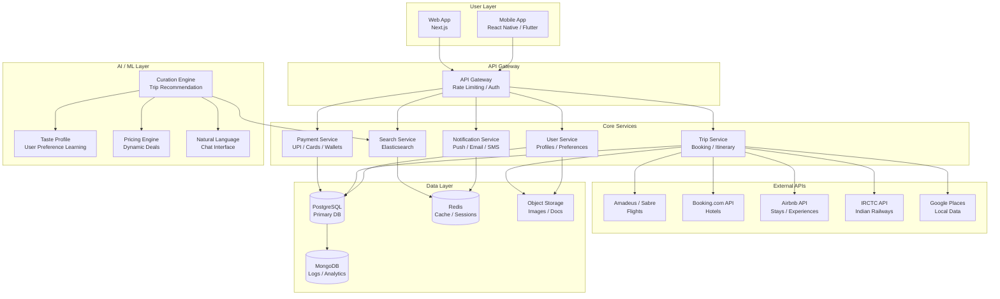

# Bhatko System Architecture

**Idea:** [Bhatko — Spontaneous Travel Platform](../../ideas/developing/2026-05-15-bhatko-spontaneous-travel-platform.md)
**Type:** architecture
**Created:** 2026-05-15

---

## Description

High-level system architecture for the Bhatko spontaneous travel platform. Shows the mobile app, backend services, AI curation engine, and third-party integrations.

## Diagram

## Notes

- **Mobile-first** — React Native or Flutter for iOS + Android
- **AI Curation Engine** — Core differentiator. Python/TensorFlow or use OpenAI API
- **External APIs** — Start with Booking.com Affiliate + Amadeus. Add others later.
- **IRCTC** — Critical for India market (8B passengers/year)
- **Payments** — Must support UPI, Paytm, PhonePe for India
- **Caching** — Redis for session management and frequent queries
- **Scalability** — Services are decoupled; can scale independently
