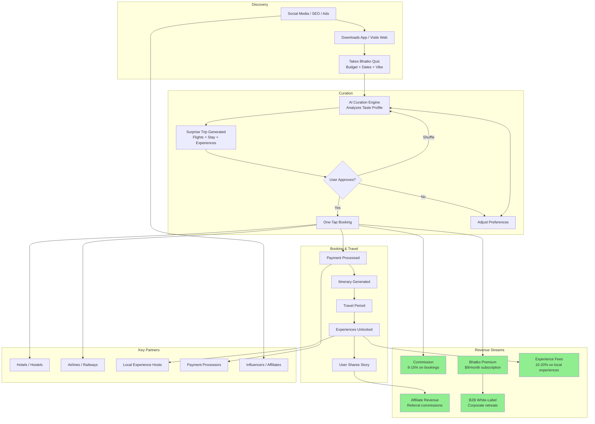

# Bhatko Business Model Flow

**Idea:** [Bhatko — Spontaneous Travel Platform](../../ideas/developing/2026-05-15-bhatko-spontaneous-travel-platform.md)
**Type:** business
**Created:** 2026-05-15

---

## Description

Visual flow of how Bhatko creates and captures value. Shows the user journey, revenue streams, and key partnerships.

## Diagram

## Revenue Model Summary

| Stream | Description | Margin | Volume |
|--------|-------------|--------|--------|
| Booking Commission | % of flight/hotel/experience bookings | 8-15% | High |
| Bhatko Premium | Monthly subscription for advanced AI, perks | $9/mo | Medium |
| Experience Fees | % of local experience bookings | 10-20% | Medium |
| Affiliate Revenue | Referral fees from partners | 3-8% | Medium |
| B2B White-Label | Corporate retreat planning tool | Custom | Low |

## Unit Economics (Target)

- **Average Booking Value**: $300
- **Commission per Booking**: $30 (10%)
- **Customer Acquisition Cost**: $15
- **Lifetime Value**: $150 (5 rebookings)
- **LTV:CAC Ratio**: 10:1 ✓
