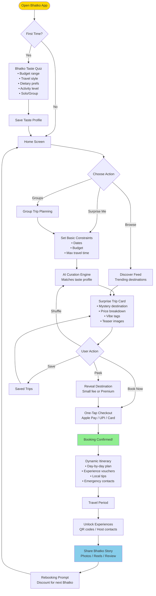

# Bhatko User Flow — Surprise Trip Booking

**Idea:** [Bhatko — Spontaneous Travel Platform](../../ideas/developing/2026-05-15-bhatko-spontaneous-travel-platform.md)
**Type:** flow
**Created:** 2026-05-15

---

## Description

Core user flow for booking a surprise trip on Bhatko. From app open to booking confirmation.

## Diagram

## Key UX Principles

1. **Speed** — From app open to booking in < 2 minutes
2. **Trust** — Clear price breakdown, flexible cancellation, 24/7 support
3. **Delight** — Mystery destination reveal is a dopamine moment
4. **Social** — Easy sharing creates organic growth
5. **Rebooking** — Post-trip nudge with personalized discount
