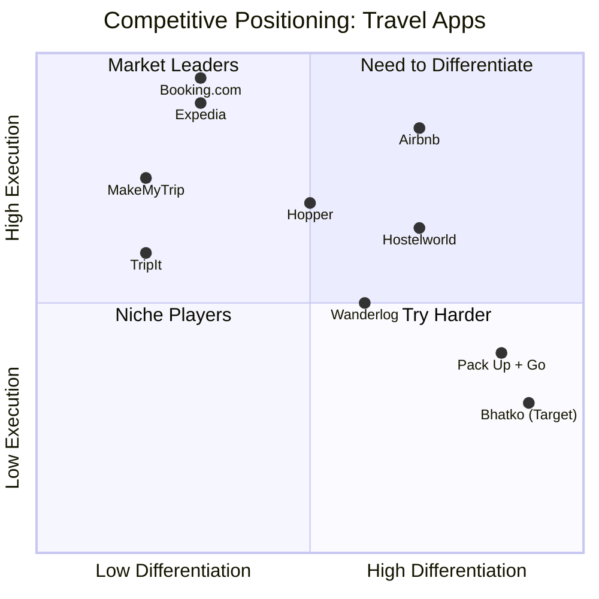

# Competitor Analysis: Bhatko vs. Travel Market

**Idea:** [Bhatko — Spontaneous Travel Platform](../ideas/developing/2026-05-15-bhatko-spontaneous-travel-platform.md)
**Date:** 2026-05-15
**Researcher:** AI Curator

---

## Market Landscape

---

## Direct Competitors

### Booking.com
| Attribute | Details |
|-----------|---------|
| Website | booking.com |
| Founded | 1996 |
| Valuation | ~$120B (Booking Holdings) |
| Strengths | Largest inventory, global reach, strong SEO, Genius loyalty |
| Weaknesses | Overwhelming choice, decision fatigue, no spontaneity, generic |
| Our Advantage | **AI-curated surprise trips** vs. endless scrolling |

### Expedia
| Attribute | Details |
|-----------|---------|
| Website | expedia.com |
| Founded | 1996 |
| Valuation | ~$15B |
| Strengths | Package deals, corporate travel, brand recognition |
| Weaknesses | Clunky UX, poor mobile, no personalization |
| Our Advantage | **Mobile-first, AI-native** vs. legacy tech |

### Airbnb
| Attribute | Details |
|-----------|---------|
| Website | airbnb.com |
| Founded | 2008 |
| Valuation | ~$100B |
| Strengths | Unique stays, experiences, strong brand, community |
| Weaknesses | Not focused on spontaneity, expensive, regulatory battles |
| Our Advantage | **Surprise trips + local immersion** at lower price points |

### Hopper
| Attribute | Details |
|-----------|---------|
| Website | hopper.com |
| Founded | 2015 |
| Funding | ~$730M |
| Strengths | Price prediction, fintech (Hopper Wallet), Gen Z appeal |
| Weaknesses | Flight-focused, not experience-focused, limited surprise element |
| Our Advantage | **Complete trip surprise** vs. just price alerts |

---

## India-Specific Competitors

### MakeMyTrip / Goibibo
| Attribute | Details |
|-----------|---------|
| Market Share | ~60% of Indian OTA market |
| Strengths | Train booking (IRCTC), deep India inventory, brand trust |
| Weaknesses | Cluttered UI, poor curation, no personality, no spontaneity |
| Our Advantage | **"Bhatko" brand emotion + AI curation** vs. utilitarian booking |

### Ixigo
| Attribute | Details |
|-----------|---------|
| Strengths | Train focus, price alerts, budget audience |
| Weaknesses | Narrow focus, weak brand |
| Our Advantage | Broader experience + surprise positioning |

---

## Niche / Concept Competitors

### Pack Up + Go (Surprise Trips)
| Attribute | Details |
|-----------|---------|
| Website | packupgo.com |
| Model | US-only surprise trip planner |
| Price | $400-2000+ per person |
| Strengths | Proves surprise trip demand exists |
| Weaknesses | US only, expensive, manual curation, slow |
| Our Advantage | **Global, AI-powered, budget-friendly, instant** |

### Wanderlog (Trip Planner)
| Attribute | Details |
|-----------|---------|
| Website | wanderlog.com |
| Model | Collaborative trip planning + booking |
| Strengths | Good UX, map-based planning, social features |
| Weaknesses | Planning-focused, not spontaneity-focused |
| Our Advantage | **We eliminate planning entirely** |

### Hostelworld
| Attribute | Details |
|-----------|---------|
| Website | hostelworld.com |
| Model | Hostel booking for backpackers |
| Strengths | Strong backpacker community, reviews |
| Weaknesses | Accommodation-only, no experiences, dated UX |
| Our Advantage | **Full-trip curation + experiences + community** |

---

## Feature Comparison Matrix

| Feature | Bhatko (Planned) | Booking.com | Airbnb | Hopper | Pack Up + Go |
|---------|-----------------|-------------|--------|--------|--------------|
| Surprise/AI Trips | ✅ | ❌ | ❌ | ❌ | ✅ |
| Complete Booking | ✅ | ✅ | ✅ | ❌ | ✅ |
| Local Experiences | ✅ | ❌ | ✅ | ❌ | ❌ |
| Budget Focus | ✅ | ❌ | ❌ | ⚠️ | ❌ |
| Group Planning | ✅ | ❌ | ❌ | ❌ | ❌ |
| Mobile-First | ✅ | ⚠️ | ✅ | ✅ | ❌ |
| India Deep | ✅ | ⚠️ | ⚠️ | ❌ | ❌ |
| Social/Community | ✅ | ❌ | ⚠️ | ❌ | ❌ |
| Offline Mode | ✅ | ❌ | ❌ | ❌ | ❌ |

Legend: ✅ = Yes, ❌ = No, ⚠️ = Partial

---

## SWOT Analysis

### Strengths (Our Advantages)
1. **Unique brand** — "Bhatko" is emotional, memorable, culturally rooted
2. **Blue ocean niche** — No global AI surprise-trip platform exists
3. **AI-native** — Built for 2026, not retrofitted
4. **India beachhead** — Massive home market, cultural resonance
5. **Multiple monetization paths** — commissions, premium, affiliate, SaaS

### Weaknesses (Our Gaps)
1. **No inventory yet** — Need API partnerships
2. **No brand recognition** — Starting from zero
3. **Single founder** — Need team/co-founders
4. **No funding** — Bootstrapped initially

### Opportunities (Market Gaps)
1. **Spontaneous travel category** — Underserved globally
2. **India domestic boom** — 2B+ trips, growing fast
3. **AI personalization wave** — Early mover advantage
4. **Experience economy** — Travelers want memories, not just beds
5. **Social travel** — Group planning is fragmented

### Threats (What Could Crush Us)
1. **Booking.com copies surprise trips** — They have the inventory
2. **Airbnb expands spontaneity** — Strong brand + experiences
3. **Economic recession** — Travel is discretionary
4. **Inventory API changes** — Partners can cut off access
5. **Bad PR from a surprise trip gone wrong** — Trust is fragile

---

## Strategic Recommendations

### Defensive Moats
1. **Brand** — Own "Bhatko" = spontaneous travel in consumer minds
2. **Data** — AI taste profiles get better with every trip (network effects)
3. **Local relationships** — Host partnerships are hard to replicate
4. **Community** — Travelers who Bhatko together, stay together

### Attack Strategy
1. **Start niche** — Weekend surprise trips in India
2. **Own the narrative** — Content marketing: "Why I stopped planning trips"
3. **Viral features** — Trip reveals, Bhatko stories, surprise unboxings
4. **Partners, not competition** — Use Booking.com/Airbnb APIs initially

---

## Key Takeaways

1. **No direct competitor** exists for AI-powered global spontaneous travel
2. **Pack Up + Go proves demand** — but they're manual, expensive, US-only
3. **Incumbents are slow** — Booking.com won't move fast on niche features
4. **India is undefended** — MakeMyTrip is functional but has zero soul
5. **Window is NOW** — AI + mobile + spontaneity trends converging in 2026
