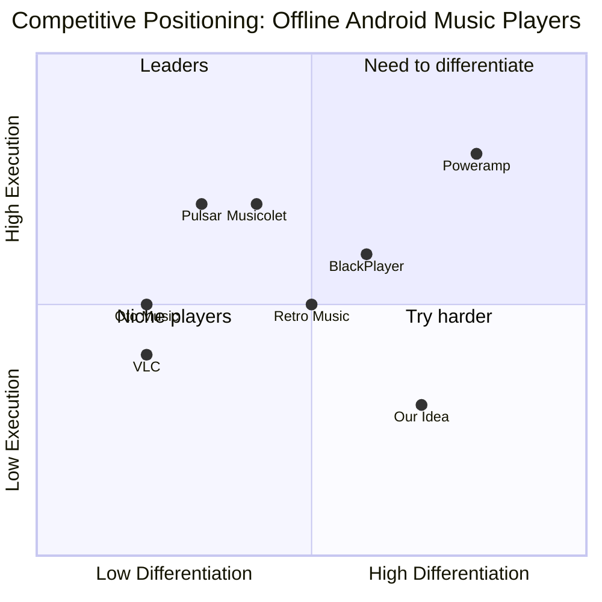

# Competitor Analysis: Simple Offline Music Player for Android

**Idea:** [Simple Offline Music Player for Android](../ideas/raw/2026-05-21-simple-offline-music-player-android.md)
**Date:** 2026-05-21
**Researcher:** AI Curator

---

## Market Landscape

**How to read this:** Our idea aims for high differentiation (design-first, true offline, zero ads) but is currently low execution (not built yet). The gap is in the top-right: a player that executes as well as Poweramp but with the simplicity and ad-free ethos of Musicolet.

---

## Direct Competitors

### Musicolet Music Player

| Attribute     | Details                                                                                                   |
| ------------- | --------------------------------------------------------------------------------------------------------- |
| Developer     | Krosbits (India)                                                                                          |
| Downloads     | 5M+ (Play Store)                                                                                          |
| Target Users  | Power users who want offline, ad-free playback                                                            |
| Core Features | Multi-queue (up to 20), tag editor, 5-band EQ, sleep timer, lyrics, folder browsing, widgets              |
| Pricing       | **100% Free. No ads. Optional donations.**                                                                |
| Strengths     | Zero ads, extremely lightweight (<5MB), no internet permission, multi-queue is unique, fast               |
| Weaknesses    | UI is utilitarian/pragmatic (not beautiful), limited customization, no themes, no cloud sync              |
| Our Advantage | We can beat Musicolet on **design polish and Material You aesthetics** while matching its ad-free promise |

---

### Poweramp

| Attribute     | Details                                                                                                 |
| ------------- | ------------------------------------------------------------------------------------------------------- |
| Developer     | Max MP                                                                                                  |
| Downloads     | 50M+ (Play Store)                                                                                       |
| Target Users  | Audiophiles and power users who want maximum control                                                    |
| Core Features | 30-band graphic EQ, DSP presets, 100+ format support, gapless playback, visualizer, skins, Android Auto |
| Pricing       | Free trial (15 days), then **$4.99 one-time** or ~$1.99/year subscription                               |
| Strengths     | Best-in-class audio processing, massive customization, mature codebase, huge user base                  |
| Weaknesses    | Overwhelming for casual users, dense UI, requires payment for full use, not truly "simple"              |
| Our Advantage | We win on **simplicity and zero learning curve** — Poweramp is a power tool, we are a daily driver      |

---

### BlackPlayer / BlackPlayer EX

| Attribute     | Details                                                                                       |
| ------------- | --------------------------------------------------------------------------------------------- |
| Developer     | FifthSource                                                                                   |
| Downloads     | 10M+ (Play Store)                                                                             |
| Target Users  | Users wanting a customizable offline player with modern design                                |
| Core Features | 5-band EQ, gapless playback, themes, widgets, folder view, tag editor, sleep timer            |
| Pricing       | **Free with ads** + **BlackPlayer EX ($3.49 one-time)** for no ads + advanced features        |
| Strengths     | Clean UI, highly customizable, good balance of features                                       |
| Weaknesses    | **Ads in free version**, free version is limited, EX purchase is required for full experience |
| Our Advantage | We are **ad-free from the start** — no friction, no "upgrade to remove ads" dark pattern      |

---

### Pulsar Music Player

| Attribute     | Details                                                                                       |
| ------------- | --------------------------------------------------------------------------------------------- |
| Developer     | Rhythm Software                                                                               |
| Downloads     | 5M+ (Play Store)                                                                              |
| Target Users  | Users wanting a beautiful, lightweight offline player                                         |
| Core Features | Material Design, gapless playback, tag editor, Chromecast, Android Auto, widgets, sleep timer |
| Pricing       | **Free + Pulsar+ (~$2.99)** for themes, EQ, and more                                          |
| Strengths     | Beautiful UI, only ~4MB, ad-free base experience, Chromecast support                          |
| Weaknesses    | Basic EQ locked behind premium, no multi-queue, less powerful than Musicolet                  |
| Our Advantage | We can offer **more power than Pulsar (multi-queue, better EQ) while keeping the beauty**     |

---

### Oto Music

| Attribute     | Details                                                                             |
| ------------- | ----------------------------------------------------------------------------------- |
| Developer     | Independent / Open Source                                                           |
| Downloads     | 500K+ (Play Store + F-Droid)                                                        |
| Target Users  | Privacy-conscious users, open-source enthusiasts                                    |
| Core Features | Material Design, offline playback, tag editor, lyrics, themes, sleep timer          |
| Pricing       | **100% Free, Open Source**                                                          |
| Strengths     | Open source, no ads, no tracking, clean UI, F-Droid presence                        |
| Weaknesses    | Very niche, smaller feature set, limited format support, slow updates               |
| Our Advantage | We can match the **open-source ethos but with faster iteration and broader appeal** |

---

## Indirect Competitors

### YouTube Music / Spotify (Offline Mode)

- **How they solve it:** Users download playlists for offline listening within the streaming app
- **Why users still look elsewhere:** Requires active subscription, DRM restrictions, can't play local files easily, bloated app

### Samsung Music / Xiaomi Music (OEM Players)

- **How they solve it:** Pre-installed on devices, basic offline playback
- **Why users still look elsewhere:** Limited features, often discontinued or replaced, not available on all devices

### VLC for Android

- **How they solve it:** Plays virtually every format, open source, no ads
- **Why users still look elsewhere:** Not designed for music libraries (it's a video player first), clunky music management UI

---

## Feature Comparison Matrix

| Feature                    | Our Idea | Musicolet | Poweramp   | BlackPlayer | Pulsar    | Oto |
| -------------------------- | -------- | --------- | ---------- | ----------- | --------- | --- |
| 100% Offline (no net perm) | ✅       | ✅        | ⚠️         | ❌          | ⚠️        | ✅  |
| Ad-Free                    | ✅       | ✅        | ⚠️ trial   | ❌ free     | ✅ base   | ✅  |
| Material You / Modern UI   | 🔄       | ❌        | ⚠️         | ✅          | ✅        | ✅  |
| Multi-Queue                | 🔄       | ✅        | ❌         | ❌          | ❌        | ❌  |
| Advanced EQ (10+ band)     | 🔄       | ⚠️ 5-band | ✅ 30-band | ⚠️ 5-band   | ❌ (paid) | ❌  |
| Tag Editor                 | 🔄       | ✅        | ✅         | ✅          | ✅        | ✅  |
| Gapless Playback           | 🔄       | ✅        | ✅         | ✅          | ✅        | ⚠️  |
| Sleep Timer                | 🔄       | ✅        | ✅         | ✅          | ✅        | ✅  |
| Widgets                    | 🔄       | ✅        | ✅         | ✅          | ✅        | ⚠️  |
| Android Auto               | 🔄       | ✅        | ✅         | ✅          | ✅        | ❌  |
| Lyrics Support             | 🔄       | ✅        | ✅         | ✅          | ✅        | ✅  |
| Open Source                | 🔄       | ❌        | ❌         | ❌          | ❌        | ✅  |
| Lightweight (<10MB)        | 🔄       | ✅        | ❌         | ⚠️          | ✅        | ✅  |
| One-Time Pro Purchase      | 🔄       | N/A       | ✅         | ✅          | ✅        | N/A |
| Themes / Customization     | 🔄       | ❌        | ✅         | ✅          | ❌ (paid) | ✅  |

Legend: ✅ = Yes, ❌ = No, ⚠️ = Partial/Limited, 🔄 = Planned

---

## SWOT Analysis

### Strengths (Our advantages)

1. **Founder-is-user** — We are building exactly what we want to use
2. **Design-first positioning** — Most competitors are feature-first, design-second
3. **True zero-permission** — Even "offline" apps often request internet for analytics/ads
4. **Open-source potential** — Builds trust, attracts contributors, free F-Droid distribution

### Weaknesses (Our gaps)

1. **No existing brand or user base** — Starting from zero downloads
2. **Feature gap vs. mature apps** — Musicolet and Poweramp have years of refinement
3. **Solo/small team** — Limited bandwidth for rapid feature development
4. **No revenue yet** — Bootstrapped, time is the main cost

### Opportunities (Market gaps)

1. **"Musicolet with better design"** — A common sentiment in reviews
2. **Privacy wave** — Growing awareness of app permissions and tracking
3. **Spotify quitters** — Rising subscription fatigue pushing users to own music
4. **F-Droid gap** — Very few beautiful, full-featured open-source music players

### Threats (What could crush us)

1. **Musicolet updates** — If they redesign their UI, our main differentiation evaporates
2. **Google policy changes** — Scoped Storage, background execution limits, etc.
3. **OEM bundling** — Samsung/Xiaomi could ship a decent offline player and kill indie demand
4. **Feature bloat pressure** — Users will demand more features, threatening the "simple" vision

---

## Pricing Intelligence

| Competitor  | Model                     | Price Point                 | Notes                                                            |
| ----------- | ------------------------- | --------------------------- | ---------------------------------------------------------------- |
| Musicolet   | Free + Donations          | $0                          | Optional donations only; sustainable because it's a side project |
| Poweramp    | Freemium (trial + paid)   | $4.99 one-time or ~$1.99/yr | Most expensive; justifies it with audio quality                  |
| BlackPlayer | Freemium (ads + EX)       | Free / $3.49 EX             | EX removes ads + adds features                                   |
| Pulsar      | Freemium (base + premium) | Free / $2.99+               | Premium unlocks EQ, themes                                       |
| Oto Music   | Free / Open Source        | $0                          | Zero monetization; community-driven                              |
| Retro Music | Freemium                  | Free / Pro IAP              | Pro unlocks themes, extra features                               |

**Recommended pricing for our app:**

- **Core app:** Free, ad-free, open-source
- **Pro tier:** One-time $2.99–$3.99 for premium themes, advanced EQ (10-band), extra widgets, Android Auto
- **Donations:** GitHub Sponsors / Buy Me a Coffee for supporters

---

## Key Takeaways

1. **Musicolet is the one to beat** — Not because it's the best, but because it's free, ad-free, and feature-rich. Its weakness (design) is our opportunity.

2. **"Free + Ad-Free" is table stakes** — Any new player that has ads or forces payment will be dead on arrival. The baseline expectation is zero cost, zero ads.

3. **Poweramp owns the audiophile segment** — We should NOT compete on raw audio power. We compete on UX and simplicity.

4. **Pulsar proves design matters** — It has fewer features than Musicolet but survives on beauty alone. We need BOTH beauty and power.

5. **Open source is a moat** — In a market of closed-source apps, being open-source builds trust and attracts a loyal community.

## Strategic Recommendations

1. **Differentiate on design + zero-permission** — Make these the headline features in every listing and screenshot
2. **Match Musicolet's core feature set** — Multi-queue, tag editor, sleep timer, folder view are non-negotiable
3. **Price the Pro tier at $2.99** — Lower than Poweramp/BlackPlayer EX to reduce friction
4. **Launch on F-Droid before Play Store** — Establish credibility with the privacy community first
5. **Build in public** — Share development progress on Reddit/Twitter to build an audience before launch
