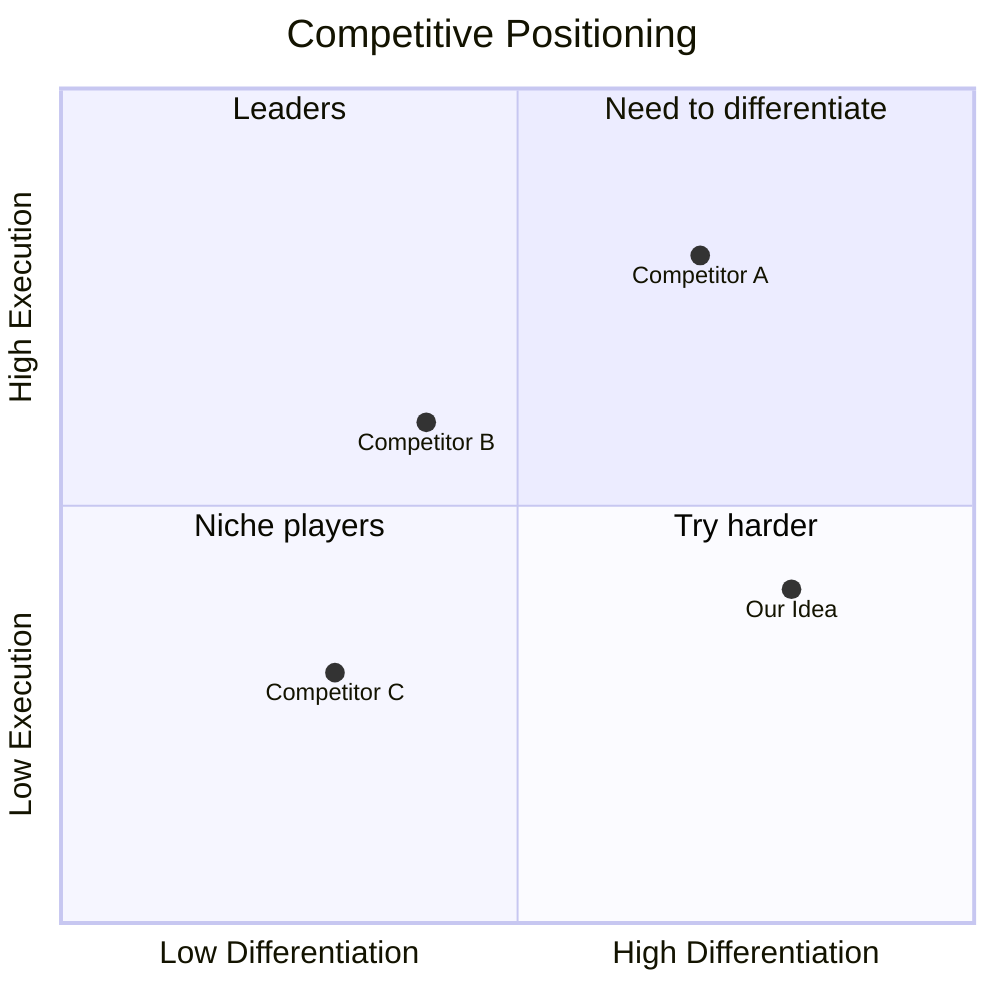

# Competitor Analysis: [Idea Name]

**Idea:** [Link to parent idea]
**Date:** YYYY-MM-DD
**Researcher:** AI Curator

---

## Market Landscape

---

## Direct Competitors

### [Competitor Name]
| Attribute | Details |
|-----------|---------|
| Website | |
| Founded | |
| Funding | |
| Target Users | |
| Core Features | |
| Pricing | |
| Strengths | |
| Weaknesses | |
| Our Advantage | |

---

## Indirect Competitors

### [Competitor Name]
[How they solve the same problem differently]

---

## Feature Comparison Matrix

| Feature | Us | Comp A | Comp B | Comp C |
|---------|-----|--------|--------|--------|
| Feature 1 | ✅ | ✅ | ❌ | ✅ |
| Feature 2 | ✅ | ❌ | ✅ | ✅ |
| Feature 3 | 🔄 | ✅ | ✅ | ❌ |

Legend: ✅ = Yes, ❌ = No, 🔄 = Planned

---

## SWOT Analysis

### Strengths (Our advantages)
1. 
2. 

### Weaknesses (Our gaps)
1. 
2. 

### Opportunities (Market gaps)
1. 
2. 

### Threats (What could crush us)
1. 
2. 

---

## Pricing Intelligence

| Competitor | Model | Price Point | Notes |
|------------|-------|-------------|-------|
| | | | |

---

## Key Takeaways

1. 
2. 
3. 

## Strategic Recommendations

1. 
2. 
3. 
