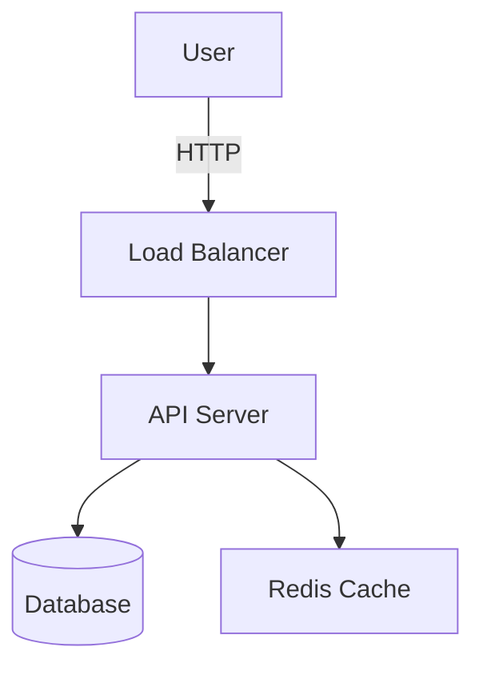
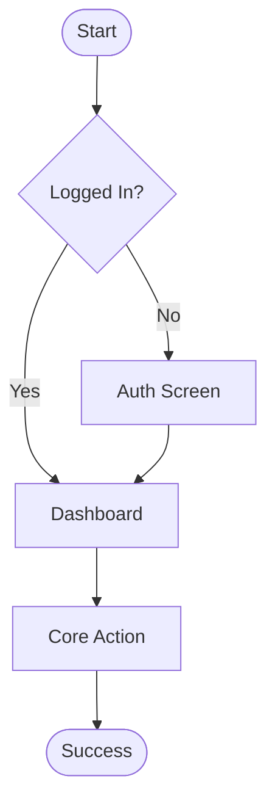
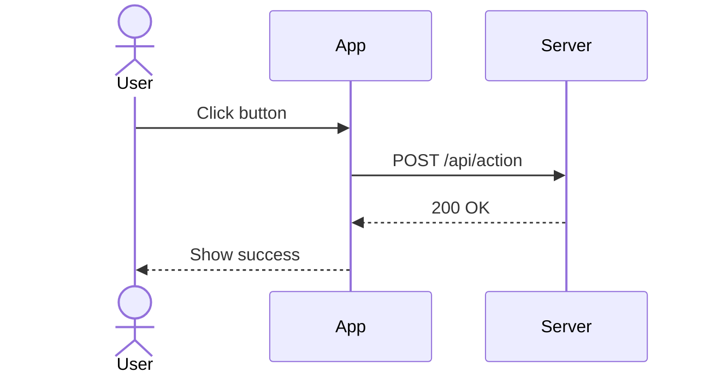
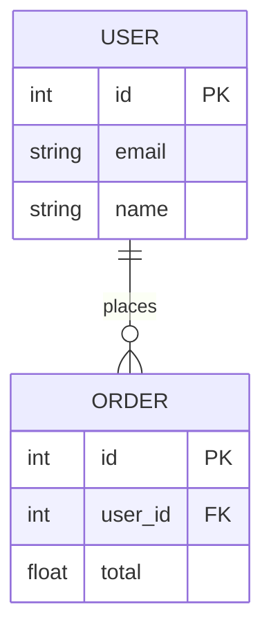
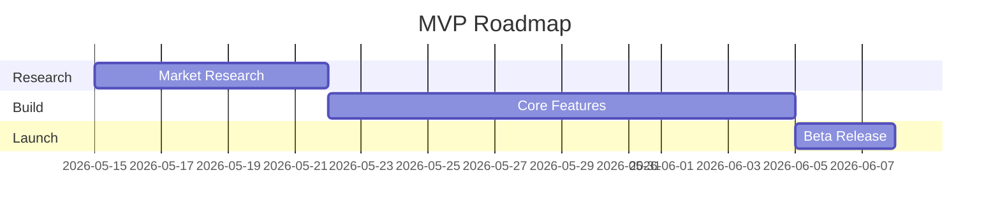
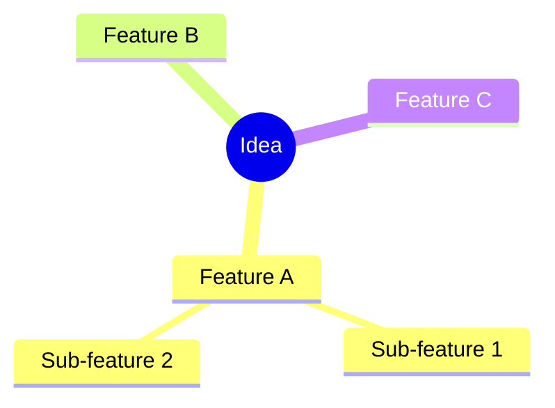
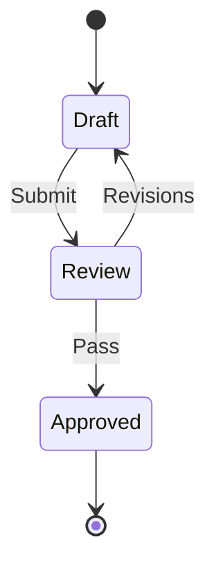

# Diagram Standards

> All visual artifacts in DreamBoard use **Mermaid** syntax. This ensures they render natively on GitHub, in VS Code, in any markdown viewer, and require zero external tools.

## Why Mermaid?

- ✅ Renders on GitHub automatically
- ✅ Version-controllable (it's just text)
- ✅ Editable by both you and AI
- ✅ No build step, no dependencies
- ✅ Exportable to PNG/SVG when needed via GitHub or Mermaid Live Editor

## File Naming

```
YYYY-MM-DD-[idea-slug]-[diagram-type].mermaid.md
```

Examples:
- `2026-05-15-coffee-drone-architecture.mermaid.md`
- `2026-05-15-coffee-drone-user-flow.mermaid.md`
- `2026-05-15-coffee-drone-roadmap.mermaid.md`

## Diagram Types Reference

### 1. System Architecture


### 2. User Flow


### 3. Sequence Diagram


### 4. Entity Relationship


### 5. Gantt Chart (Roadmap)


### 6. Mind Map


### 7. State Diagram


## Styling Guidelines

- Use clear, descriptive node names
- Group related components with `subgraph`
- Add direction hints (`TB`, `LR`, `RL`, `BT`) for clarity
- Keep diagrams focused — one concept per diagram
- For complex systems, break into multiple diagrams

## Rendering Tips

- On GitHub: Mermaid renders automatically in markdown files
- In VS Code: Install "Markdown Preview Mermaid Support" extension
- Online editor: https://mermaid.live
- Export: Use Mermaid Live Editor to export PNG/SVG when needed
